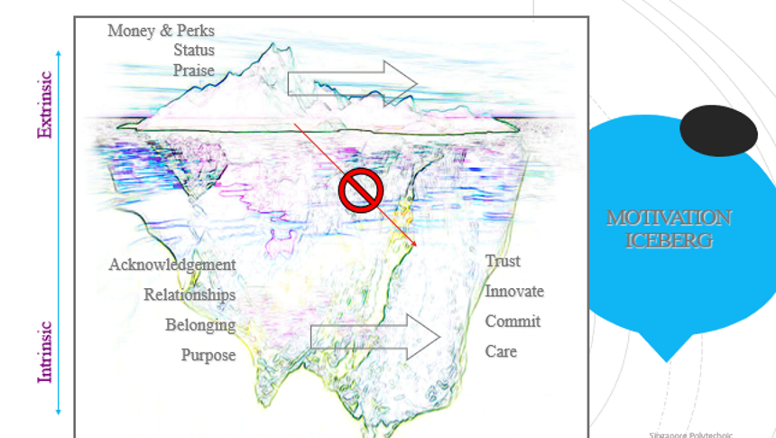
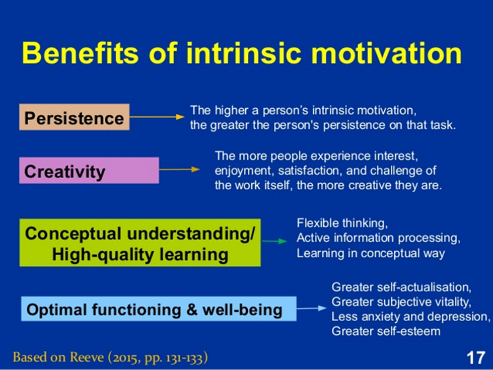

# Lecture 3 Motivation
Motivation is a personal competence. There are 2 types of motivation: Intrinsic & extrinsic.
- `Intrinsic`: motivated by interest, within the individual
- `Extrinsic`: motivated by external things, e.g., a reward

## Achievement Drive
> Striving to improve or meet a standard of excellence (Striving to improve and meet a standard of excellence)

- People with this competence 
    - Are results-oriented with a high drive to meet their objectives and standards 
    - Set challenging goals and take calculated risks 
    - Pursue information to reduce uncertainty and find ways to do better 
    - Learn how to improve their performance 

## Commitment
> Embracing the organization's or group's vision and goals (Aligning with the goals of a group or organization)

- People with this competence 
    - Readily make sacrifices to meet a larger organizational goal 
    - Find a sense of purpose in the larger mission 
    - Use the group’s core values in making decisions and clarifying choices 
    - Actively seek out opportunities to fulfil the group’s mission 

e.g., Jack Ma being rejected for many times during his life but his perseverance made him a successful businessman who created online platform for people to do shopping

## Initiative
> Mobilize people to seize opportunities and allow them to take setbacks and obstacles in stride (displaying proactivity and persistence)

- People with this competence
    - Are ready to seize opportunities 
    - Pursue goals beyond what’s required or expected of them 
    - Cut through red tape and bend the rules when necessary to get the job done 
        - "cut through red tap" : To circumvent bureaucratic obstacles (which are often referred to as "red tape") in order to accomplish something.
    - Mobilize others through unusual enterprising efforts  

In this [video](https://www.youtube.com/watch?v=Na7oYhGi_Co), Mrs Chong never gave up on her student Edwin, who was not academically talented and involved himself in some gang activities.

## Optimism
> Mobilize people to seize opportunities and allow them to take setbacks and obstacles in stride (displaying proactivity and persistence)
    
- People with this competence 
    - Persist in seeking goals despite obstacles and setbacks 
    - Operate from hope of success rather than fear of failure 
    - See setbacks as due to manageable circumstances rather than personal flaw 

e.g., [Susan Boyle on Britain's Got Talent](https://www.youtube.com/watch?v=_zZPLohsmO0), a woman whose wish is to become a professional singer, impressed the audience who did not believe that she has the ability to realise her dream.