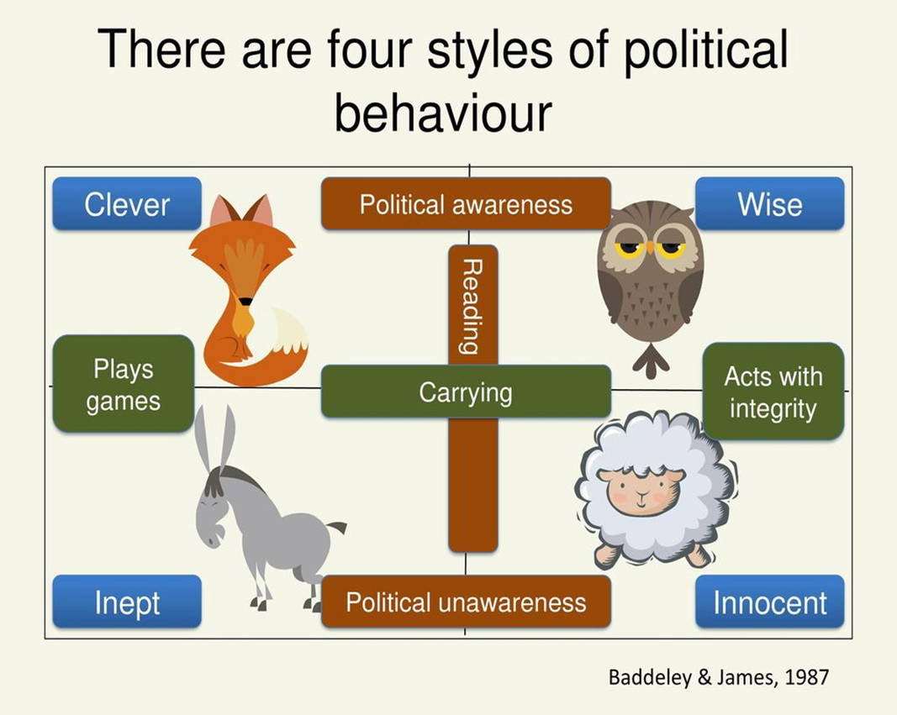

# Lecture 4,5 Empathy
Empathy is a social competence.

## Understanding Others
> Sensing others' feelings and perspectives and taking an interest in their concerns
    
- People with this competence 
    - Are attentive to emotional cues and listen well 
    - Shows sensitivity and understand others’ perspectives 
    - Help out based on understanding other people’s needs and feelings 

Watch [Sesame Street: Mark Ruffalo: Empathy](https://www.youtube.com/watch?v=9_1Rt1R4xbM) to get to know about empathy~

### Empathy vs Sympathy
- Empathy involves understanding and sharing someone's feelings, 
    - You feel what they feel. If they're sad, you feel sad too, as if the situation happened to YOU.
- while Sympathy involves feeling compassion or pity for their situation. 
    - You feel compassionate about their expreience, but that's all. They're sad, and you comfort them with "it's okay don't worry"...

### 5 Steps of Empathy
- Body language: it shows that you care and you share the feeling with them.
- Listening: paying attention to what they say makes people feel cared
- Recognizing pain: acknowledge that it's a pain
- Verbal response
- Action response 

### Too much empathy?
Sometimes people absorb too much from others, feeling overwhelmed due to too much empathy they possess. It shows a lack of balance and self-care. You can:

- Set boundaries, allow space for your recharge and practice self-care
- Self-compassion
- Seek support from others
    - Therapists also have their own therapists...
- Practice perspective-taking: differentiate between understanding and absorbing others' emotions

## Developing Others
> Sensing others' development needs and bolstering their abilities

- People with this competence 
    - Acknowledge and reward people’s strengths and accomplishments 
    - Offer useful feedback and identify people’s needs for further growth 
    - Mentor, give timely coaching and offer assignments that challenge and foster a person’s skills 

## Service Orientation
> Anticipating, recognizing and meeting customers' needs
    
- People with this competence 
    - Understand customers’ need and match them to services or products 
    - Seek ways to increase customers’ satisfaction and loyalty 
    - Gladly offer appropriate assistance 
    - Grasp a customer’s perspective, acting as a trusted advisor 

Service orientation is not only existing in business context. It can also be an interpersonal skill and contributes to your social awareness, others' well-beings, and your kindness towards others.


## Leveraging diversity
> Cultivating opportunities through diverse people (Cultivating opportunities through different kinds of people)
    
- People with this competence
    - Respect and relate well to people from varied backgrounds
    - Understand diverse worldviews and are sensitive to group differences 
    - See diversity as opportunity creating an environment where diverse people can thrive 
    - Challenge bias and intolerance 

``` 
Club Méditerranée, commonly known as Club Med, is a French corporation of vacation resorts found in many parts of the world, usually in exotic locations. It is considered the original all-inclusive resort.
```

## Political awareness
> Reading the political and social currents in an organization
    
- People with this competence
    - Respect and relate well to people from varied backgrounds
    - Understand diverse worldviews and are sensitive to group differences 
    - See diversity as opportunity creating an environment where diverse people can thrive 
    - Challenge bias and intolerance 

### Political awareness model

| Animal  | Behaviour style  |
|---|---|
| Sheep  | Innocent behaviour,openly shares information,loyal but need to be led, sticks to the rules  |
| Donkey | Inept behaviour, lacks integrity, ignore the political power bases in order to achieve what they want.  |
| Fox  | Clever behaviour, politically astute, uses their intelligence for their gain. Good at winning support for their ideas.  |
| Owl  | Wise behaviour, likes to create win-win situation(unlike foxes), not afraid to share their emotions and show vulnerability.  |

Watch [Minister Lawrence Wong on Race & Racism in Singapore](https://www.youtube.com/watch?v=j0D0ayvUl64&t=2468s) to learn more the importance of leveraging diversity + political awarenesss in Singapore.
- Leveraging Diversity (Respect and relate well to people from varied backgrounds) 
- Political Awareness (Accurately read key power relationships, Detect crucial social networks & Understand the forces that shape views and actions of clients, customers and competitors) 
