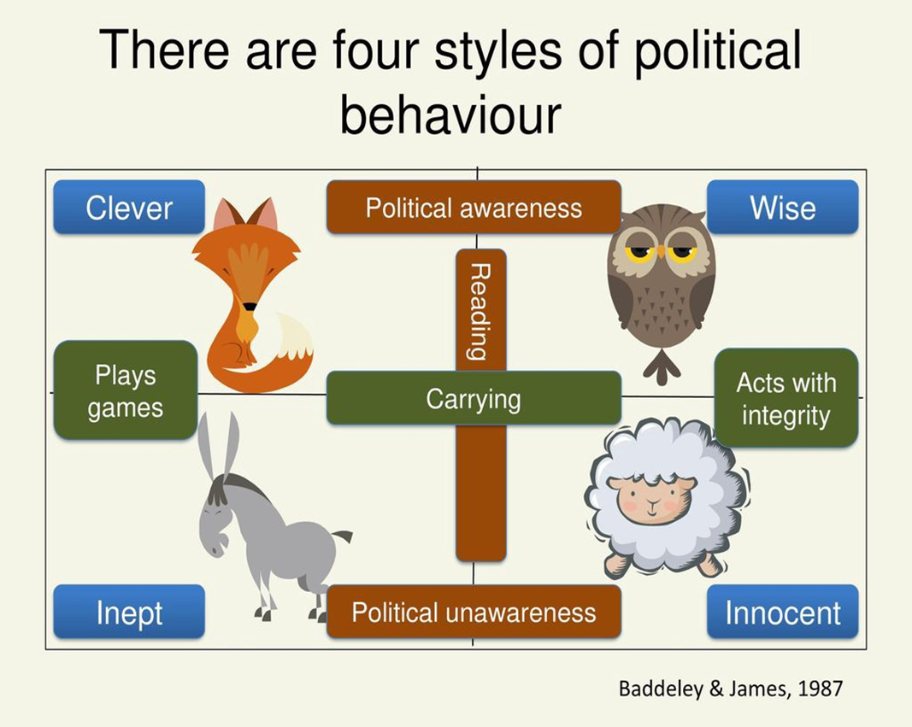

# Lecture 5 Empathy (part2)
Empathy is a social competence.

## Leveraging diversity
> Cultivating opportunities through diverse people (Cultivating opportunities through different kinds of people)
    
- People with this competence
    - Respect and relate well to people from varied backgrounds
    - Understand diverse worldviews and are sensitive to group differences 
    - See diversity as opportunity creating an environment where diverse people can thrive 
    - Challenge bias and intolerance 

``` 
Club Méditerranée, commonly known as Club Med, is a French corporation of vacation resorts found in many parts of the world, usually in exotic locations. It is considered the original all-inclusive resort.
```

## Political awareness
> Reading the political and social currents in an organization
    
- People with this competence
    - Respect and relate well to people from varied backgrounds
    - Understand diverse worldviews and are sensitive to group differences 
    - See diversity as opportunity creating an environment where diverse people can thrive 
    - Challenge bias and intolerance 

### Political awareness model

| Animal  | Behaviour style  |
|---|---|
| Sheep  | Innocent behaviour,openly shares information,loyal but need to be led, sticks to the rules  |
| Donkey | Inept behaviour, lacks integrity, ignore the political power bases in order to achieve what they want.  |
| Fox  | Clever behaviour, politically astute, uses their intelligence for their gain. Good at winning support for their ideas.  |
| Owl  | Wise behaviour, likes to create win-win situation(unlike foxes), not afraid to share their emotions and show vulnerability.  |

Watch [Minister Lawrence Wong on Race & Racism in Singapore](https://www.youtube.com/watch?v=j0D0ayvUl64&t=2468s) to learn more the importance of leveraging diversity + political awarenesss in Singapore.
- Leveraging Diversity (Respect and relate well to people from varied backgrounds) 
- Political Awareness (Accurately read key power relationships, Detect crucial social networks & Understand the forces that shape views and actions of clients, customers and competitors) 
