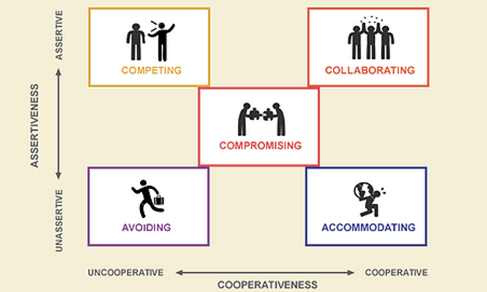
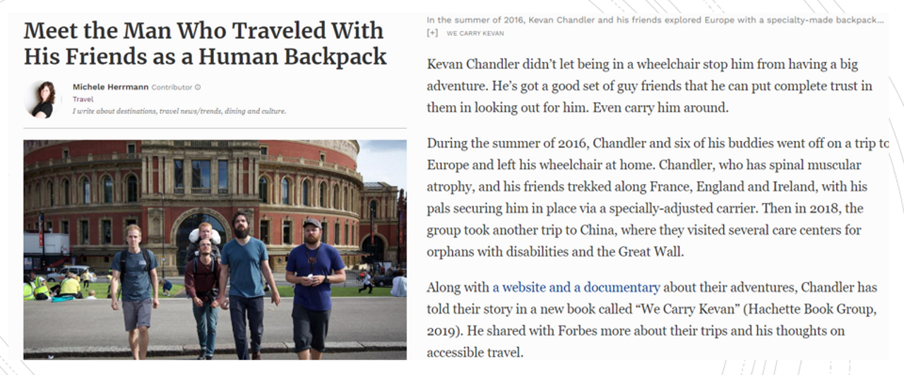

# Lecture 6,7,8 Social Skills
Social skills is a social competence. Social skills: in the essential sense of handling another person's emotions artfully, underlie several competencies: `influence`, `communication`, `conflict management`, etc. 

The failures lacked empathy and sensitivity, and so were often abrasive, arrogant or given to intimidation of subordinates. While some were charming on occasion, even seeming concerned about others, the charm was purely manipulative. The successes were empathic and sensitive, showing tact and consideration in their dealings with everyone, superiors and subordinates alike. 

## Influence
> Wielding effective tactics of persuasion
    
- People with this competence
    - Are skilled at winning people over 
    - Fine-tune presentations to appeal to listener
    - Use complex strategies like indirect influence to build consensus and support 
    - Orchestrate dramatic events to effectively make a point  

The gift of giving (video): [The Gift of Giving](https://www.youtube.com/watch?v=mdSfg8qO8ts)

## Communication
> Sending clear and convincing messages (listening openly and sending convincing messages)
    
- People with this competence
    - Are effective in give and take, registering emotional cues in attuning their message 
    - Deal with difficult issues straightforwardly 
    - Listen well, seek mutual understanding and welcome sharing of information fully 
    - Foster open communication and stay receptive to bad news as well as good news  

Conversations with dad (video): [Conversations With Dad](https://www.youtube.com/watch?v=C2Xmkg3HRp0)

## Conflict Management
> Negotiating and resolving disagreements
    
- People with this competence 
    - Handle difficult people and tense situations with diplomacy and tact 
    - Spot potential conflict, bring disagreements into the open and help to de-escalate 
    - Encourage debate and open discussion 
    - Orchestrate win-win solutions

Conflict management animation: [Conflict Management Funny animated 1](https://www.youtube.com/watch?v=eT7lt4ESSLo)

### Conflict management styles

- **Avoiding**: This style involves minimizing or ignoring the conflict, potentially by delaying the issue or withdrawing from the situation. It's often used when the issue is trivial, resolving the conflict would cause more harm than good, or when there's a lack of time or resources to address the conflict. 
- **Accommodating**: This style prioritizes the other party's needs over your own, often yielding to their demands. It's useful when maintaining a relationship is more important than your own needs, or when the other party has greater expertise or power. 
- **Compromising**: This style involves finding a middle ground where each party makes concessions to reach a solution. It's often used when time is limited, the issue is not crucial, or when a quick resolution is needed. 
- **Competing**: This style emphasizes achieving your own goals and priorities, even if it means sacrificing the other party's needs. It's used when the outcome is extremely important, when there's a need for quick and decisive action, or when the other party is trying to exploit you. 
- **Collaborating**: This style focuses on working together to find a solution that satisfies everyone's needs and interests. It's most effective when the issue is complex, there's a need for a long-term solution, and the parties are willing to invest time and effort in finding a mutually beneficial outcome. 

## Leadership 
> Inspiring and guiding
    
- People with this competence 
    - Articulate and arouse enthusiasm for a shared vision and mission 
    - Step forward to lead as needed, regardless of position 
    - Guide the performance of others while holding them accountable 
    - Lead by example

> Sir Richard Charles Nicholas Branson: Sir Richard Charles Nicholas Branson (born 18 July 1950) is an English business magnate and investor. He is best known as the founder of Virgin Group, which comprises more than 400 companies.

“Good people are crucial to business success. Finding them, managing them, inspiring them and then holding onto them are among the most important challenges a good business leader faces. How you deal with these matters often determines the long- term success and growth of your business.” 

## Change catalyst
> Initiating, promoting and managing change

- People with this competence
    - Recognize the need for change and remove barriers 
    - Challenge the status quo to acknowledge the need for change 
    - Champion the change and enlist others in its pursuit 
    - Model the change expected of others 

Watch [Mr kumar](https://youtu.be/uRpFltRldUA) to learn about making a change

## Building bonds
> Nurturing instrumental relationships

- People with this competence
    - Cultivate and maintain extensive informal networks 
    - Seek out relationships that are mutually beneficial 
    - Build rapport and keep others in the loop 
    - Make and maintain personal friendships among work associates 

### "We carry Kevan" (literally)

[We carry Kevan - In China, Episode1](https://youtu.be/nETAGLSmbW8)

- The **insensitivity and manipulative manner** of the failed group meant that the failed group meant that they failed to build a strong network of cooperative, mutually beneficial relationship. 
- The successes were more **appreciative of diversity, able to get along with people of all kinds.** 

## Collaboration and cooperation
> Working with others towards the shared goals

- People with this competence
    - Balance a focus on task with attention to relationships 
    - Collaborate, sharing plans, information and resources 
    - Promote a friendly, cooperative climate 
    - Spot and nurture opportunities for collaboration 

Read Article [How collaboration changed the world - 5 famous partnerships](https://www.post-it.com/3M/en_US/post-it/ideas/articles/how-collaboration-changed-the-world-5-famous-partnerships/)

And read this: [National athelete Ng Ming Wei and dad serious about making tiktok prank videos](https://www.todayonline.com/singapore/national-athlete-ng-ming-wei-and-dad-serious-about-making-tiktok-prank-videos)

## Team capabilities
> Creating synergy in working towards group goals

- People with this competence
    - Model team qualities like respect, helpfulness and cooperation 
    - Draw all members into active and enthusiastic participation 
    - Build team identity, esprit de corps and commitment 
    - Protect the group and its reputation; share credit 

Watch [Good teamwork and bad teamwork](https://youtu.be/fUXdrl9ch_Q)

Watch [Value of happy employees](https://www.youtube.com/watch?v=KtA67Xvz2bI)