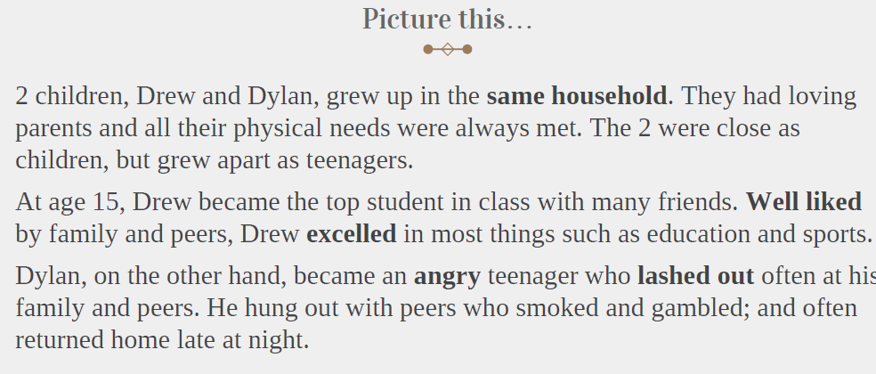
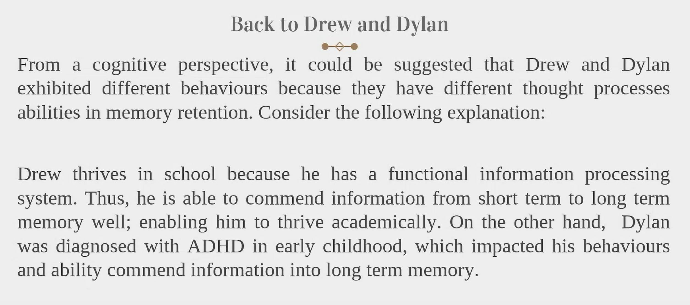
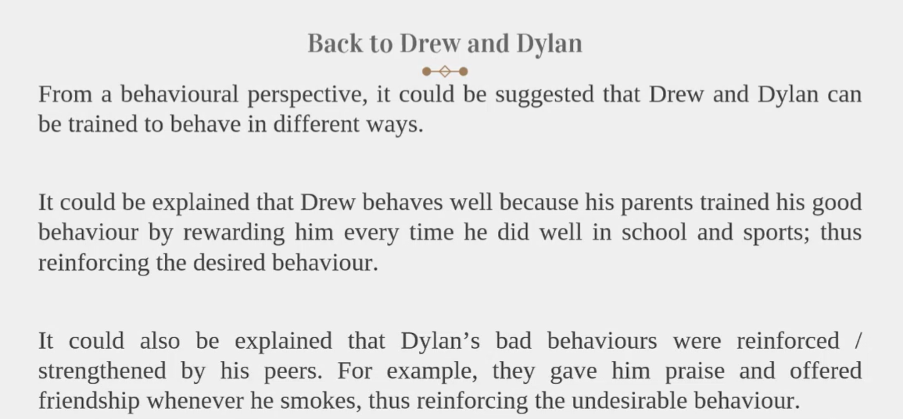
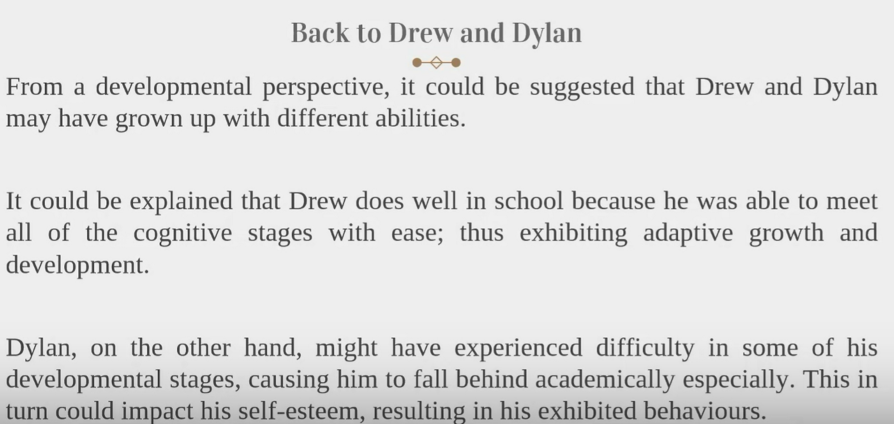
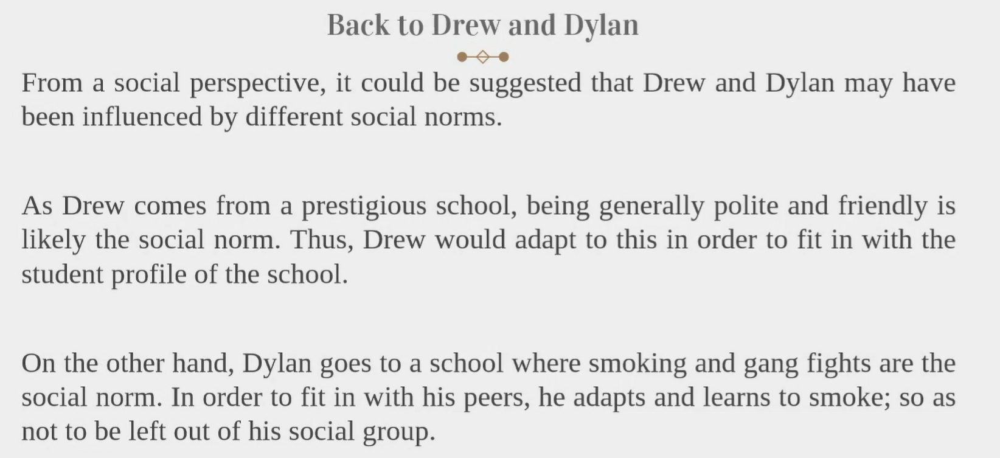
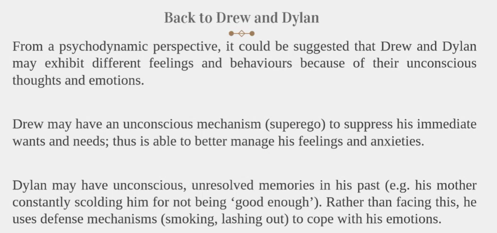

# Discovering Psychology (pt1)

## What is psychology? :heart_decoration:

~~Reading minds, hypnosis, social work...??~~
> **The scientific study of the mind and behavior** (-the American Psychological Association)

- It is a scientific study of the mind, brain and behaviour
- It is an academic and applied discipline that involves the scientific study of mental functions and behaviours
- Inquires into "hows" and "whys" of human behaviour
- Psychology believes that all actions are determined and produced by many factors

Let's look at this case study as example

## Approaches to Psychology
People's actions and behaviors are better understood through psychological approaches.

### the Cognitive approach :brain:
What does our brain to do with actions and behaviors?

1. **Mental processes**
    - The cognitive approach explores how we process information; and in turn how this processing impacts aspects such as memory, attention, language and problem solving.
2. **Faulty beliefs**
    - Explains how we sometimes have faulty or inaccurate views and beliefs of ourselves, because of how information is processed from experiences
3. **Links to behaviors**
    - Cognitive psychology provides possible explanations on how our thought processes lead to behaviors exhibited

> ADHD: Attention Deficit Hyperactivity Disorder. A neurodevelopmental condition characterized by persistent symptoms of inattention, hyperactivity, and impulsivity.

### Behaviourism (behavioral approach) :running:
1. **Conditioning**
    - Believes that people can be "conditioned" or train to behave in certain ways, and that behaviors can be encouraged/discouraged
2. **Observational learning**
    - Believes that behaviour is learned through modelling or observation
3. **Reinforcement** 
    - Believes that desired behaviours can be reinforced and undesirable behaviours can be modified through reinforcement

### Developmental approach 	:baby:
1. **Cognitive development**
    - Explores the work of cognitive theorists as Jean Piaget to explain brain development across one's lifespan
    - The stages explores can explain delays in development and its impact on the individual
2. **Socio-emotional development**
    - Explores the work of theorists such as Erik Erikson to explore the psycho-socio development from childhood to old age
    - The stages explored can explain differences in socialization between people

### Socio Psychology :people_holding_hands:
1. **Social norms and roles**
    - Explores how the social norms we practice & roles we play influence our thoughts, feelings and behaviours
    - Also explores how we can influence change in people around us
2. **Group behaviours**
    - Social psych also explores how we behave differently in groups; and how this can result in either prosocial or harmful behaviours 

### Psychodynamic approach 	:thought_balloon:
- Suggest that **our unconscious thoughts and beliefs** may influence in our actions and behaviours; even though we are not aware of it
- It also believes that **personality traits** play a part in identity formation 
- Suggests that <ins>we sometimes engage in defence mechanisms when we are unable to cope with emotional stress and anxiety</ins> (e.g., lashing out (spend a lot of money) repression (parts of memory we cannot access due to the brain's defense mechanism) and projection (displacing one's feelings into a different person, animal or object)

## Psychology - one situation but many approaches 
Let's think about it:
- Is it `nature` (born with it) or `nurture` (influenced socially)

> ### About `Psychologist` vs `Psychiatrist`
> - Psychologist has no medical training but has a doctorate degree, undergoes intense academic training learning about different areas of psychology.
>   - Not all psychologists are trained to do counselling, nor all are counsellors
>   - Basic research: gaining scientific knowledge 
>   - Applied research: answer real-world, practical problems
> - **Psychiatrist has a medical degree** and is a physician who specializes in the diagnosis and treatment of psychological disorders.

## References :book:
- Ciccarelli, S. K., & White, J. N. (2021). Psychology (6th ed). Pearson
Education Limited.
- Kalat, J. W. (2014) Introduction to psychology. 10th ed., International ed. Belmont, Calif. ;: Wadsworth, Cengage Learning.
- Lilienfeld, S. O., Lynn, S. J., Namy, L. L., & Woolf, N. J. (2015).
Psychology, from Inquiry to Understanding (3rd ed.). Pearson.
34