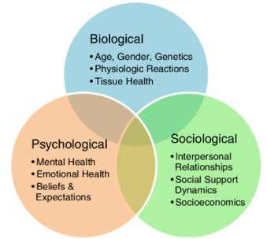

# Discovering Psychology (pt2)

## The Biopsychosocial (BPS) approach
- Commonly used to explain how **nature & nurture factors** impact both mental and physical health
    - Biological factors: age, gender, genetics
    - Social factor: interpersonal relationships, social support, social economics
    - Emotional factors: mental health, beliefs and expectations
- Explaining feelings, thoughts, and behaviors that cannot be explained with just nature or nurture
- Look at a more holistic approach to explaining behavior
- We are product of not only `biological processes` (e.g., genetics) but also for `psychological` (stress, thoughts and beliefs) and `social processes` (e.g., socioeconomic status, peer influence)
- Overall health and well-being is best understood in terms of a combination of biological, psychological, and social factors

Watch [What is Bio-Psycho-Social Model?](https://www.youtube.com/watch?v=R8ljOrYPrcw)

## Psychology in everyday life
1. Advertisement
    - Engages our senses and perceptions to be attracted to/reminded of products
2. Friendships and social interactions
    - How we identify with a social group influences our perception and thoughts about ourselves
3. Understanding our and others' emotions
    - Why we feel how we feel, when others seem to feel different
4. Finding our identity
    - Psychological approaches lend much insight into what makes us who we are and map the person we want to be
    - Explores and helps us understand personalities
5. Policy setting
    - Inform political choices such as how a nation might react to certain social changes
6. Treatment of mental health disorders
    - Inform the intervention plans for persons living with mental health issues
    - Includes administration of medication and therapy
