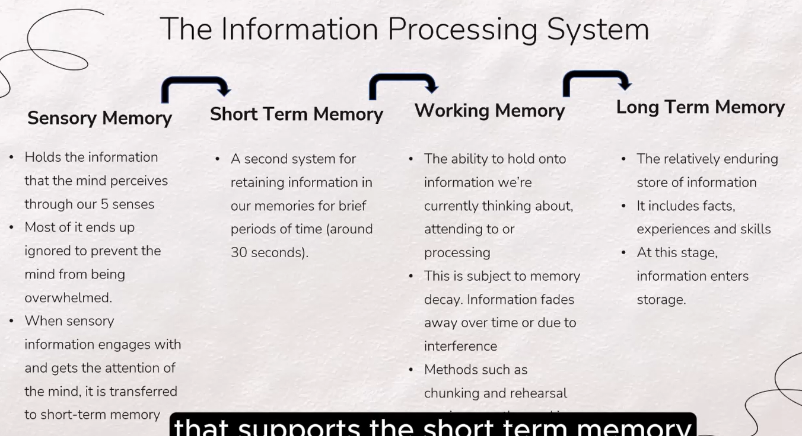

# Cognitive Psychology :brain:

## Cognitive psychology is

> the study of mental processes - how people think and process information

- Think refers to any mental activity or processing information
- Includes our ability to learn/remember/perceive/communicate/believe and make decisions

### where can we see it in everyday life

- **Memory and attention span**
  - Some people seems to remember events and content better than others/we find it difficult to pay attention to certain things -> information processing system explains this
- **Problem solving and decision-making**
- **Perceptions - interpreting situations**
  - We interpret the same situation in a different way -> attribute

## What are schemas? :package:

> `Schemas`: mental processes involved in understanding and knowing. They are categories of knowledge that help us to interpret and understand the world

- Imagine brain is a room full of boxes, each box represents different memories and information. Schemas is our brain's way of categorizing and organizing information.
- How does information enter our schemas -> assimilation, accommodation
  - `Assimilation`: process of taking in new information into existing schemas
  - `Accommodation`: process of altering existing schemas and ideas as a result of new information or experiences

There are boxes that say "do not open" as opening them may expose people to unnecessary traumas, cause anxiety, etc; schemas cause us to have faulty beliefs about ourselves

> **Faulty belief**: self-defeating thoughts are any negative views you hold about yourself and the world around you

- For example, when we fail a test, we tend to generalize that we are ‘not good enough’ instead of ‘I did well for everything except for one subject’.
- Faulty belief can lead us to automatic negative thoughts (ANTs)

### Automatic Negative Thoughts (ANTs) :sob:

- Originate from our schemas and beliefs and considered true by us
- Mental functions that occur without conscious judgement, deeply affecting our actions and emotions
- Without intervention, ANTs can severely impact our lives

## Cognitive Model (as easy as ABC!)

- `(A) Activating event`
  - Jane’s boyfriend of 2 years broke up with her. He said it was her fault for being boring and ugly, and that he had only dated her for money.
- `(B) Belief that follows the event`
  - Jane believes that she is boring and ugly. She also believes that all men cannot be trusted as they would only use her for money.
- `(C) Consequences of the belief`
  - To avoid being hurt and used, Jane has promised herself that she will never date again.

## 3 Processes of memory :thinking:

1. `Encoding`
   - The process of sending information into our memory banks
   - How information "downloads" into our schemas
   - Attention and ability to remember information can be improved using techniques such as mnemonics, music and keywording
2. `Storage`
   - The process of keeping information (long-term memory)
   - "library of schemas" that holds our information
   - Schemas can at times be unreliable and create memory illusions
3. `Retrieval`
   - The process of fetching information from long-term memory
   - Known as **recall** and **recognition**
   - What we retrieve may not match what we put in during encoding, sometimes we are unable to access some memories

> Memory decay: memory fades due to the mere passage of time

## Information Processing System :arrows_clockwise:

> Sensory memory -> short term memory (STM) -> working memory -> long term memory (LTM)

- **Chunking**: break information into parts and study each part instead of the whole thing
- **Rehearsal**: repeating information over and over again

These two help in commending information from STM to LTM

## Some extra reading (terms explanations) :notebook:

### Memory loss

- `displacement`: old information pushed out by new info
- `trace decay`: forget over time because it's not used

### More terms/definitions

- `Schema`: an organized way of interacting with objects
- `Assimilation`: applying an old schema to new objects/problems
- `Accommodation`: modifying an old schema to fir a new object/problem
- `Equilibration`: establishment of harmony/balance between assimilation between assimilation and accommodation

**Elaborative rehearsal** - increase the number of retrieval cues (stimuli that aid in remembering) for information by connecting new information with something that is already well known

## References :book:

- Ciccarelli, S. K., & White, J. N. (2021). Psychology (6th ed). Pearson Education Limited.
- (n.d.). Behavioral and Cognitive Psychology. American Psychological Association. Retrieved March 10, 2023, from
  https://www.apa.org/ed/graduate/specialize/behavioral-cognitive
- Lilienfeld, S. O., Lynn, S. J., Namy, L. L., & Woolf, N. J. (2015). Psychology, from Inquiry to Understanding (3rd ed., pp. 274-
  350). Pearson Education Limited.
- (2022, December 14). Negative Automatic Thoughts (ANTs). CBT All Psychotherapy. Retrieved March 11, 2023, from
  https://www.cbtcognitivebehavioraltherapy.com/negative-automatic-thoughts/
- (2012, July 7). Schemas, Assimilation, Accommodation, Equilibration. TRAUMA RESEARCH and TREATMENT. Retrieved
  March 10, 2023, from https://www.apa.org/ed/graduate/specialize/behavioral-cognitive
- (2023, February 23). What is Information Processing Theory? Stages, Models & Limitations. Research.com. Retrieved March
  10, 2023, from https://research.com/education/what-is-information-processing-theory
