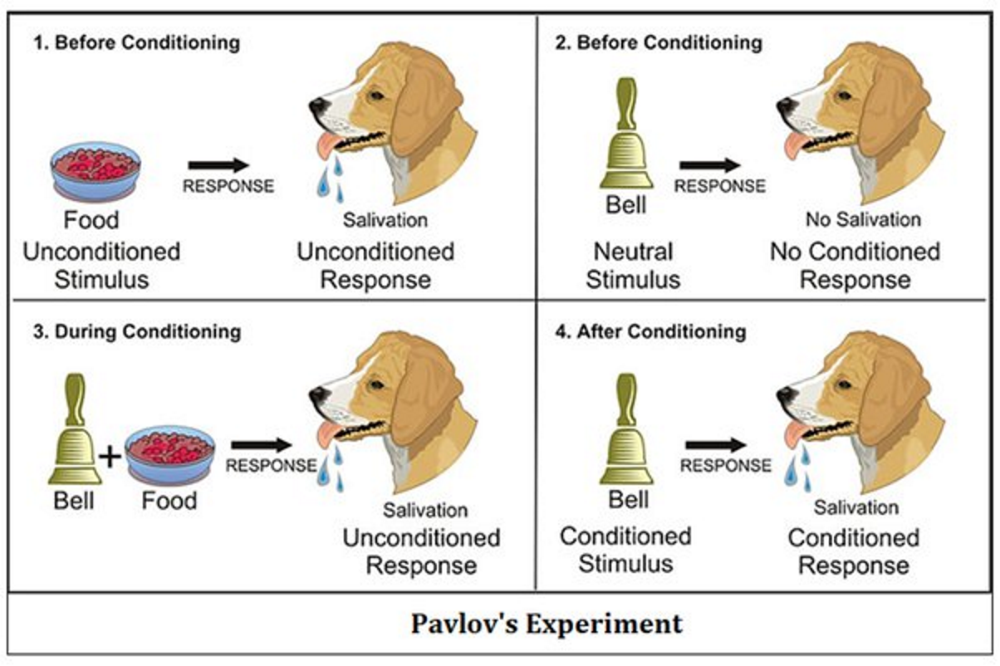
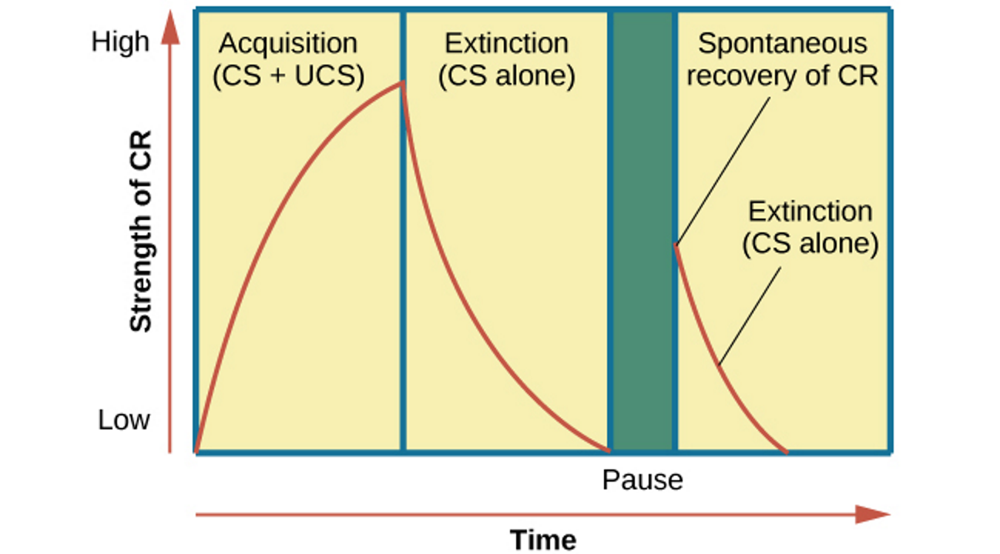

# Behaviourism

- **Behaviourism**: suggestion that **all behaviours can be learned through `conditioning`**. Can be groomed or changed through repetition and modelling
- Behaviours can be trained/modelled through interaction with the environment
- Does not consider cognitions, emotions and personality
- Types of conditioning
  - Classical conditioning
  - Operant conditioning
  - Observational learning

## Classical conditioning

- Based on the discoveries and studies of Ivan Pavlov
- Learning to make an **involuntary (independent of one's will) response**to a stimuli other than the original, natural stimulus that normally produces the response
- Learning through associations

[Pavlov’s Classical Conditioning](https://youtu.be/jd7Jdug5SRc) -> associate the salivation with the ring even if smell of meat doesn't appear anymore

| Stimulus | Example behaviour |
| ---------- | ---------------------------------------------------------------- |
| **Neutral stimulus**: doesn't elicit any particular response | The sound of the clicking metronome |
| **Unconditioned stimulus (UCS)**: items that trigger an unlearned, involuntary and automatic response | Smell of the meat powder (automatically provokes the salivation) |
| **Unconditioned response (UCR)**: the automatic response after experiencing UCS | Salivation after smelling the meat powder |
| **Conditioned response (CR)**: a learned response previously associated with a non-neutral stimulus that comes to be elicited by a neutral stimulus | The dog salivates at the sound of the metronome even in the absence of meat |
| **Conditioned stimulus (CS)**: a previous neutral stimulus that triggers a conditioned response when paired with an unconditioned stimulus | The dog associates the ring sound to the meat, hence the ring is no longer neutral, the ring is the CS | 
| **Extinction**: when the conditioned response decreases or eventually disappears | Smell of the meat powder | 

- The tendency to respond to a stimulus that is similar to the original conditioned stimulus is called `stimulus generalization`
    - People who scare of dental drilling sounds might react to similar sounds like coffee grounding machine
- To differentiate between the real and fake CS: `stimulus discrimination`

> [!NOTE]
> A reinforcer that fulfills a basic need (e.g., hunger) is called primary reinforcer
> A secondary reinforcer (e.g., money) gets its reinforcing properties from being associated with primary reinforcers

## Operant conditioning
- Based on the discoveries and studies of Edward Thorndike and B.F. Skinner, focusing on behaviour modifications
- Refers to the learning of voluntary behaviour through the **effects of pleasant and unpleasant consequences to responses**
- Focusing on the concept of `reinforcement` - the strengthening of desired bahaviours
- Promotes the law of effect: _If an action is followed by a pleasurable experience, it will tend to be repeated. If followed by an unpleasant consequence, it will tend not to be repeated._

Watch [Skinner’s Operant Conditioning: Rewards & Punishments](https://www.youtube.com/watch?v=ne6o-uPJarA) 

| Terms | Descriptions |
| ------| -------------|
| Reinforcement: any event or stimulus that when following a response, increase the probability that the response will occur again | A mother wishes to increase her child's positive behaviour of studying before playtime |
| Reinforcers: the event or objects that when following a response, increases the likelihood of that response occurring again |  The child getting more playtime (event) if he continues to study first (response) |
| Positive reinforcement: the reinforcement of a response by the addition of a pleasurable stimulus  | The child gets more playtime and can sleep later whenever he completes his study time (desired response) |
| Negative reinforcement: the reinforcement of a response by the removal, escape from or avoidance of an unpleasant stimuli | Playtime is taken away if the child does not study. Hence to avoid his unpleasant consequences, the child ensures that he studies. |
| Punishment: the punishment of a response by the addition or experiencing of an unpleasant stimulus. The punishment may not have direct relation to the action | Child is placed in the naughty chair and made to pull his ears for not studying | 
| Rewards: the rewarding of a desired response by the addition or experiencing of a pleasant stimulus. The reward may not have direct relation to the action | Child is rewarded with money every time he studies | 

### Differences between classical conditioning & operant conditioning
| Classical conditioning | Operant conditioning |
| --- | --- |
| It creates a schema that informs our future actions | Our schemas are changed/modifies through operant conditioning |
| Involuntary  | Voluntary |  
| Uses repetition of an event or situation to bring about behaviour modification | Uses reinforcers such as positive/negative reinforcements to strengthen/discourage behaviours | 
| The stimulus comes before the response (bell rings before students pack bags) | Behaviours come first before it is reinforced or discouraged (students pack bags too early, get held back by teacher) |
| Neutral stimulus is paired with an involuntary response |  Behaviour is paired with a consequence | 

## Observational learning
- Based on the discoveries and studies of Albert Bandura 
- Also known as `social learning theory`
- Refers to the **learning of new behaviour by watching a model perform the behaviour**
- Involves 4 elements: `attention`, `memory`, `imitation`, and `desire/motivation`

Watch [Social Learning Theory: Bandura’s Bobo Beatdown Experiments](https://youtu.be/XHIhkM1cAv4)

| Element | Description | 
| --- | --- |
| Attention: to learn through observation, the learner must first observe and pay attention to the model | When learning to play the guitar, you watch YT videos/others play to observe how it is done |
| Memory: the learner must retain memory of what was done | You try to remember which strings to press and how to strum the guitar | 
| Imitation: the learner must be capable of reproducing or imitating the actions of the model | You can reproduce the action of playing guitar |
| Desire/motivation: the learner must have the desire/motivation to perform the action | You are motivated to learn how to play a guitar so that you can join a band | 
