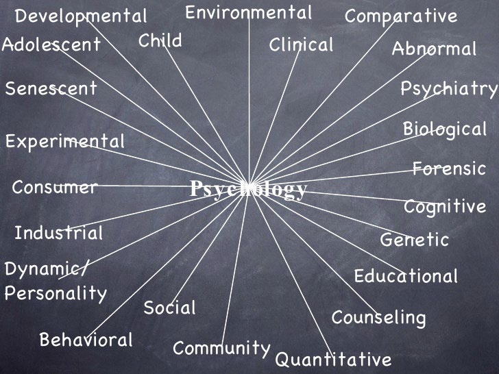
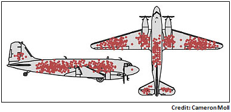
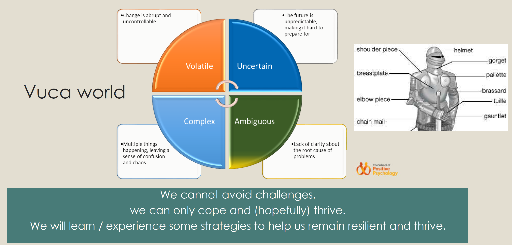
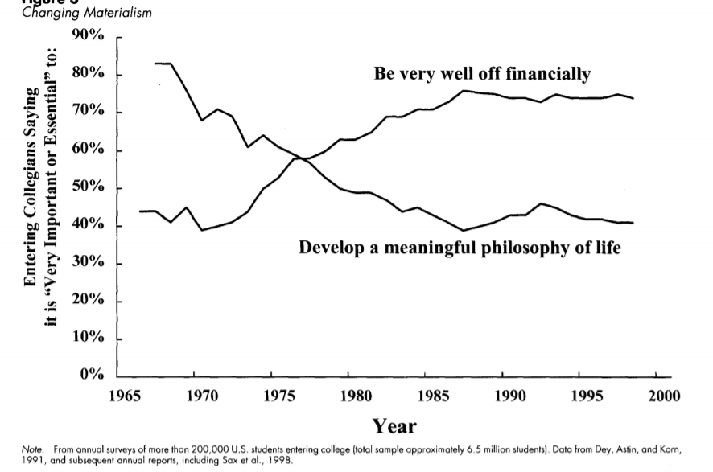
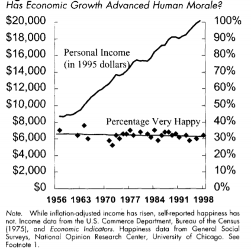
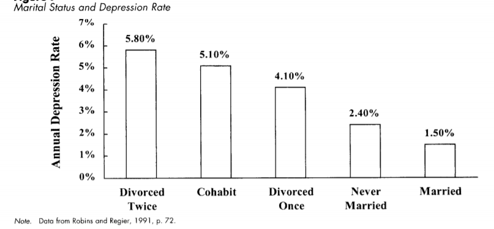
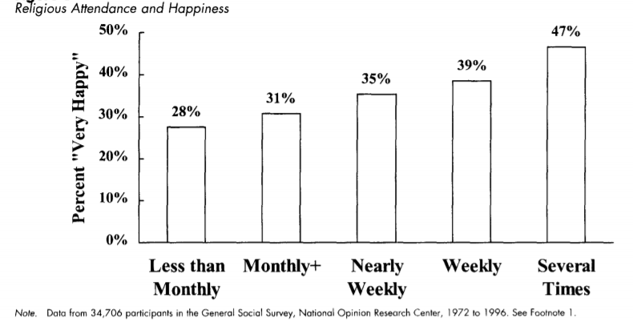

# Lecture 1 Not sad but not happy (Intro to positive psychology)

What has psychology focused on?
> To Describe, Explain, Predict and Change behaviour
Predominantly focused on curing mental illness

- Post WW II, psychology embraced **a disease model of human nature**
- People are seen as fragile and flawed
- Casualties of cruel environments (PTSD) or bad genetics
    - Post-traumatic stress disorder 
- Propagating the illness ideology: Fixing mode
- Assumption: there is something wrong with people

Overview of psychology (you'll learn some of them in intro to psych)

## Birth of positive psychology
Named in 1998 by `Martin Seligman`, president of APA (Americal Psychological Association).
- Aims to correct imbalance and challenge the pervasive assumptions of the disease model
- Focuses on strength as on weakness, interest in building the best things in life instead of repairing the worst, fulfilling the lives of healthy people instead of just healing wounds of the distressed
- What can go `right` with people.

> Promotion of what's best in people, as opposed to the prevention of what's most problematic (Seligman, 2002)

As people often ask "what are my weaknesses", they seldom focus on their strengths/virtues/passions. If we focus on weaknesses/deficiencies, all we can see are weaknesses/dificiencies. 
> Our experience of the world is heavily placed on where we place our attention (Stavros and Torres).

Look at the image below, it shows the position of holes of planes that managed to return to the hangar. Which part should we enhance so that more planes can survive? The bullet holes or the rest of good part?

- We should repair and enforce the good part as they are what brings the plane back to hangar!

**Positive psychology** is:
- Scientific study of well-being
- Studies what people do right/good and how they manage to do it
- Helps develop those qualities that lead to greater fulfillment for themselves and others
- It is NOT a spectator sport, you need to get in the game and experience it for yourself. -> highly experiential

We all live in a `vuca world`.

> "VUCA world" refers to a rapidly changing and uncertain environment characterized by Volatility, Uncertainty, Complexity, and Ambiguity

Coping strategies are like the armour that protects different parts of our body from being damaged by the outside world/dangers/challenges.

### Types of well-being
- `Hedonic (subjective) well-being`
    - a current feeling of happiness
    - The realisation of happiness, pleasure attainment and pain avoidance
    - Prevalence of Positive Affect (PA) over Negative Affect (NA)
- `Eudaimonic (psychological) well-being`
    - Happiness for the future, pursuing happiness by finding meaning and purpose
    - Personal Growth, Mastery and Self Realisation
    - Associated with Physical and mental health

> In PPWB, it aims to cover both types of well-beings - how to increase positive emotions and also how to plan for a more meaningful and fulfilling life.

## What makes us happy?
Money? Getting married with your love? Have a firm religious belief?

Although more people are financially well off, the percentage of people who developed a meaningful philosophy of life decreased.

Although personal income (economic level) has significantly grown over years, the percentage of people who are happy are stablized at 30%. So higher income doesn't guarantee more happiness.

What can you find based on the images below?

## Why are we not really happy?
### 1. Reference points (comparing)
Because we constantly compare ourselves with others. 

Example 1: new car. 
> Let's say someone won a car in lottery. Within a year in the neighbourhood, it's twice as likely to have a new car (Kuhn, 2011)

Example 2: More pay.
> People are given two options: 1-earn $50k, but everyone else in your company at your same level earns $25k. 2-earn $100k, but everyone else earns $250k. Most people chose option 1.
- Because people compare themselves and others, looked at the difference between what they and their colleagues can earn. Although in number 25k is lower than 50k, but they earn more than others.

Example 3: Studies show that the use of social media has negative correlation with self-esteem. (meaning that the more you use social media, the lower your self-esteem is) (Vogel, 2015)

Example 4: 
> The lecturer gives student an option to add 0.567% to their final grade. For a student who scored 69%, he gets 69.567% (=> 70%) which helps him up a grade. Only 50% students will get a grade upgrade and the other half won't.

> 41% students rejected this proposal, even though nobody goes down and everyone has a half chance of going up. Rejections are higher in the top 50% of class.
- Because students compared themselves with others. They may not be the one who get upgraded, and others are possible to be, which possibly shorten their distances.

Example 5: Medalists.
> The happiest person among top 3 is not the gold medalist, it's the bronze medalist because "pewww luckily I made it top 3!". Meanwhile the silver medalist is the unhappiest one because "haiz I could have made it to gold..."

**Core of story: we'll never be happy if we keep comparing ourselves to someone else.**

### 2. Hedonic adaptation
Hedonic adaptation is the tendency of us mere humans to **quickly return to a relatively stable level of happiness** despite major recent positive or negative events or life changes. (eg., you get 4.0 gpa, happy for a while, and you go back to the normal state)
- Things quickly become the new normal.
- We get used to things 
- Invest in experiences instead of material things. (Laurie Santos)

### 3. Impact bias (Dan Gilbert)
The idea that **we tend to overestimate the emotional impact of things (intensity and duration)** -works both ways
- we are less happy than we think we will be when we meet a success
- less sad than we think we will be when we meet a setback

### 4. Immune neglect (Dan Gilbert)
**Tendency to overlook our ability to cope.** We are unaware of the power of what he calls our psychological immune system. So we avoid things that we fear.
- We just have this tendency to adapt to and cope with negative events.
- We are resilient as we have mechanisms to help us cope, for e.g. go out, eat with friends
- In short, you don't know how resilient you're.

### 5. Affective/hedonic forecasting
> ** In psychology, "affect" refers to the immediate and outward expression of emotions, moods, or feelings.

Affective forecasting, also known as hedonic forecasting, is **predicting how you will feel in the future.**
- In Wilson and Gilbert's research, they found that people **misjudge** what will make them happy and have trouble seeing through the filter of the present. They also discovered that how people feel in the moment blinds them, coloring the decisions they will make down the road. (in 5 years' time you will think differently, the events will affect you differently too)
- We do not think about the needs of our future selves; time discounting is a focus on what matters today and not so much on what matters tomorrow.
- **What is important to us today may not be as important tomorrow.**
    
So don't hold back yourself from trying new things, don't let fear stop you even if you fail, you won't feel as bad as imagined.

## More about this module
In PPWB, you will learn about
- Positive interventions
- Well being (PERMA, using strengths, etc)
- Resilience
- Energy management

> To live is the rarest thing in the world. Most people just exist. - Oscar Wilde
