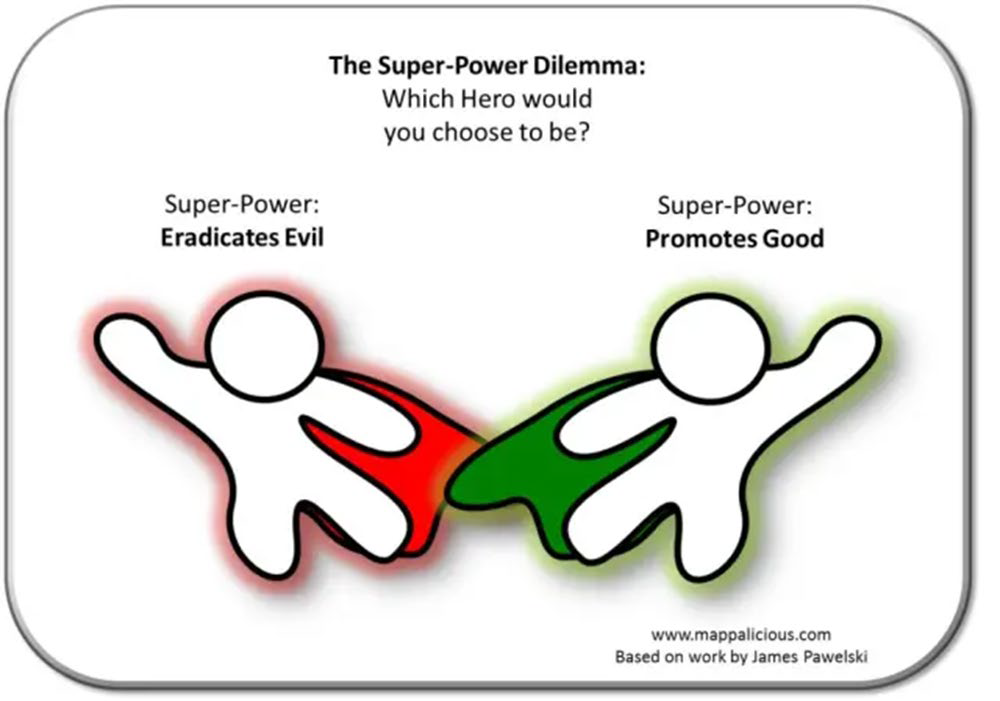
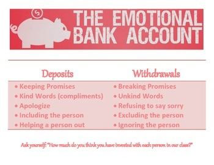
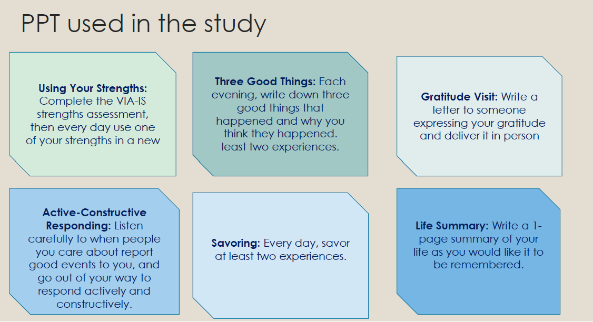
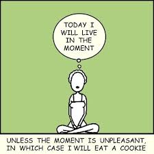
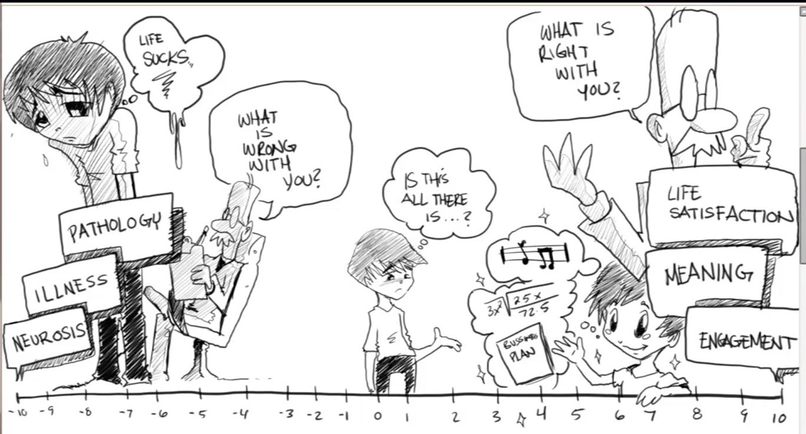

# Lecture 2 Positive Interventions (1)

## What is health? :muscle:
> Health is a state of complete positive physical, mental, and social well‐being and not merely the absence of disease or infirmity.
- A person doesn't have diabetes/high blood pressure/cholesterol problems, he/she is not necessarily healthy!
- Like physical health, you can build up psychological immunity to fight off (mental) illness.

## Red cape x Green cape
Now you can choose 1 from the 2 capes: (Pawelski, James, 2016)
- :red_circle: The red cape gives you the power to fight injustice, catch the bad guys, and hold back oppression, poverty, and sickness. You are a warrior against all that is bad in the world.
> Winston Churchill said “We shall defend our island, whatever the cost may be, we shall fight on the beaches, we shall fight on the landing grounds, we shall fight in the fields and in the streets, we shall fight in the hills; we shall never surrender.
- :green_circle: The green cape gives you the power to bring more good into the world, build communities, feed the hungry, and bring hope, health, and happiness to the masses. You are a warrior of light bringing all that is good and just. 
> Mother Theresa said “I will never attend an anti-war rally; if you have a peace rally, invite me."

## The green cape - positive interventions! :heavy_plus_sign:
- A **positive psychology intervention (PPI)** was defined in accordance with Sin and Lyubomirsky’s(2009) article as <ins>a psychological intervention (training, exercise, therapy) primarily aimed at raising positive feelings, positive  cognitions or positive behaviors </ins> opposed to interventions aiming to reduce symptoms, problems or disorders.
- **Positive psychotherapy (PPT)** rests on the hypothesis that depression can be treated effectively not only by reducing its negative symptoms but also by <ins>directly and primarily building positive emotions, character strengths, and meaning.</ins>
- It is possible that directly building these positive resources may successfully counteract negative symptoms and may also buffer against their future reoccurrence.

### The emotional bank account :bank:
We keep an emotional bank account in our relationship with others. We do good things to deposit so that our relationship becomes better, and bad behaviours hurt us and we withdraw, less "money" is left within the account. When it reaches 0, for a single wrong thing you do it may break the relationship.

### PPT used in the study

For this session, 4 interventions are introduced. (from Yale course - the science of well being, Laurie Santos)

## 1 - Gratitude Journaling :bookmark_tabs:
> Definition from Harvard Medical : “a thankful appreciation for what an individual receives, whether tangible or intangible. With gratitude, people acknowledge the goodness in their lives … As a result, gratitude also helps people connect to something larger than themselves as individuals–whether to other people, nature, or a higher power"

Gratitude journaling is to record daily things that you feel grateful for, and revisit the entries and you regain the gratefulness.

- Enhanced well being
    - Grateful people are more agreeable, more open, and less neurotic (McCullough et al., 2002)
    - gratitude is related inversely to depression, and positively to life satisfaction (Wood, Joseph, & Maltby, 2008).
- Deeper relationships
    - People who express their gratitude for each other tend to be more willing to forgive others and less narcissistic (DeShea, 2003)
    - Giving thanks to those who have helped you strengthens your relationships and promotes relationship formation and maintenance
- Improved optimism
    - 10 weeks study (Emmons and Mccullogh, 2003) people who focused on gratitude showed more optimism in many areas of their lives, including health and exercise.
- Increased happiness
    - Toepfer, Cichy, and Peters (2011) conducted a study asking people to write and deliver a letter to someone for whom they were grateful. After the task, their happiness levels and life satisfaction were dramatically impacted—even weeks later.

## 2 - Savouring :kissing_closed_eyes:
>  we attempt to fully feel, enjoy and extend our positive experiences

Jose, Lim, Bryant (2012)-momentary savouring were positively related to momentary happy mood.
‘habitual’ savorers are more likely to maintain happy mood in the absence of positive life events, compared to people who do not consistently savor positive daily events.

When pleasant daily events were frequent, higher levels of momentary savoring did not enhance positive mood compared to lower levels of momentary savoring.

- **Savor the past**
    - As you are thinking back on the pleasant event, **think about the people, smells, sounds, physical sensations, and sights that you experienced.** Think about —and try to re-create —the positive emotions that you felt around the time of the event. As you are savoring, let your thoughts wander to anything else about the happy experience that makes you feel good. Then, just mentally hold on to whatever feels good.
    - Take a deep breath, and pay attention to how these emotions feel in your body. Let the emotions fade on their own, until you are ready to go back to whatever else you were doing.
- **Savor the present**
    - **You do this by paying attention any time you experience something positive.** Whenever you notice yourself feeling good, mentally hold on by thinking about the positive emotions and what caused them. You may want to also practice gratitude, reminding yourself that you are grateful for whatever or whoever caused these positive emotions.
    - **Capitalize on the present**
        - `Show it`: express in your facial expressions or body language. To laugh/smile/throw hands up in the air, which help to prolong the feelings
        - `Tell it`: talk to someone about why you're happy. Share the experience with others. Others tend to respond well to expressions of positive emotions, which can further generate more positive emotions for you.
        - `Share it`: send a text message or posting kindly on social media. If there is something you are feeling great about, particularly something you think would make others feel great too, share it far and wide with a post.
- **Savor the future**
    - We can often experience positive emotions when we strive for a goal, even before we have achieved that goal. How? **By using imagination to increase happiness.**
    - For example, you might be looking forward to when you can travel again. If so, you could practice savoring by thinking about what you’ll do, who will be there, and the positive emotions you hope to feel. As a result, you’ll generate positive emotions from an event that hasn’t even happened yet

## 3 - Mindfulness :relieved:
> Mindfulness is **the basic human ability to be fully present, aware of where we are and what we're doing,** and not overly reactive or overwhelmed by what's going on around us.

Do you know that
- Our minds wander 47% of the time.
- A wandering mind is unhappy mind (Matthew A. Killingsworth)
- Mindfulness can help the default mind network
- `Default mind network (DMN)` is the region of the brain network that us used when not focused on tasks. Same region as when you are thinking about past and future (get out of here and now)
    - **Rectify - meditation**. Meditators can shut down the DMN in daily life, not only during meditation. Strengthening brain matter, higher grades with meditation as compared to nutrition.
- <ins>Mindfulness’ reduces stress and anxiety, improves attention and memory, and promotes self-regulation and empathy.</ins>
    
> Eight-week Mindfulness-Based Stress Reduction (MBSR) Program, 16 participants, average 27 min a day. Participant-reported reductions in stress also were correlated with **decreased gray-matter density** in the amygdala, which is known to play an important role in stress and anxiety. (Sara Lazar, neuroscientist and AP of psychology at Harvard Medical School(HMS))

## 4 - Random acts of kindness
As the name suggests, do acts of kindness randomly in your life. Eg., Give some change to the tissue uncle you saw on your way home, help a passerby, etc.
- Studies show that a 1-week intervention that simply asks people to count kindnesses may increase people's subjective happiness.
- Kindness is an important human strength that influences subjective well-being. Kindness contributes to good social relationships and can thereby be viewed as adaptive

## Why practice positive interventions?
- increase your well being/positive emotions/green cape
- You are further away from feeling sad/falling into depression when unfortunate circumstances befall you
- You will have practiced some strategies, and these help you recover faster from your sadness/depression (if it happens)

I forgot what's the correct caption for this... something like "intervention is not helping you to get out from the sad zone (left), it's to help you go towards the happy zone" 

> To laugh often and much; to win the respect of the intelligent people and the affection of children; to earn the appreciation of honest critics and endure the betrayal of false friends; to appreciate beauty; to find the beauty in others; to leave the world a bit better whether by a healthy child, a garden patch, or a redeemed social condition; to know that one life has breathed easier because you lived here. This is to have succeeded. ―Ralph Waldo Emerson

## References
- Pawelski, James. (2016). Defining the ‘positive’ in positive psychology: Part II. A normative analysis. The Journal of Positive Psychology. 11. 1-9.
- Seligman, M. E. P., Rashid, T., & Parks, A. C. (2006). Positive psychotherapy.American Psychologist, 61(8), 774–788.https://doi.org/10.1037/0003-066X.61.8.774
- Emmons RA, McCullough ME. Counting blessings versus burdens: An experimental investigation of gratitude and subjective well-being in daily life.Journal of Personality and Social Psychology.2003;84:377–389.
- Jose, Paul & Lim, Bee & Bryant, Fred. (2012). Does savoringincrease happiness? A daily diary study. The Journal of Positive Psychology. 7. 176-187.
- https://www.psychologytoday.com/sg/blog/click-here-happiness/201807/what-is-savoring-and-why-is-it-the-key-happiness
- https://medium.com/swlh/the-brains-default-mode-what-is-it-and-why-meditation-is-the-antidote-d0408ab989d6
- Otakeet al. (2006).Happy people become happier through kindness: A counting kindnesses intervention.Journal of happiness studies, 7(3), 361-375.
- https://news.harvard.edu/gazette/story/2011/01/eight-weeks-to-a-better-brain/