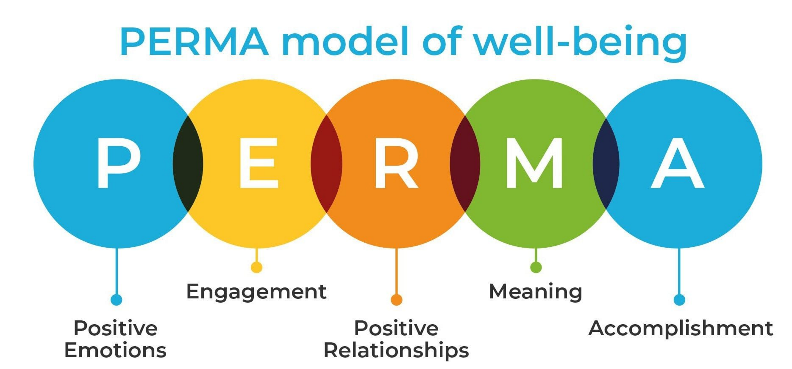

# Lecture 3 PERMA

## What is well-being? :blush:
> Well-being is the experience of health, happiness, and prosperity. It includes having good mental health, high life satisfaction, a sense of meaning or purpose, and ability to manage stress. **More generally, well-being is just feeling well.**

### Benefits of well-being
- Physical well-being :runner:
    - Lower incidence of cardiovascular disease, stroke, and sleeping difficulties
    - `Lower levels of cortisol` (i.e. stress hormone), less self-reported physical symptoms and pain, a decreased risk to automobile fatality, and a decreased likelihood of engaging in unhealthy behaviours (e.g., smoking)
    - Increased likelihood of engaging in healthy promoting activities (e.g., exercising), `longer survival time following an illness` and quickened physical recovery and return to normal activities following surgery.
    - A relationship has been observed between wellbeing and `a decreased risk of all causes of death` (i.e. increased overall longevity) (6)
    - `Heightened ability to cope and remain positive during difficult times` (14), and an increased likelihood of receiving emotional and tangible assistance
- Psychological well-being :hearts:
    - Happy people are less inclined to feel jealous, less likely to experience conflict and more likely to `be superior at resolving conflicts.`
    - They are more accepting and less critical of themselves and others, and are judged as `more physically attractive, intelligent, competent, friendly, and warm` than their less happy counterparts.
    - Happiness has also been found to lead to `an increased number of reliable and supportive friends` (19)
    - Those high on well-being have also been found to contribute to their communities by volunteering their time (12)
- Productivity :pencil2:
    - `An increased likelihood of graduating from university`, higher rates of job attainment, more positive supervisor evaluations, superior performance and productivity, organization citizenship behaviour (i.e. acts that go beyond the requirements of the job, such as helping other people at work in various ways) and a greater ability to handle managerial position (4)
    - Those with high degrees of happiness have also been found to be `less likely to show counter-productive workplace behaviour and job burnout` (4)
    - Personal income has been found increase with well-being, and some such research suggests that well-being precedes and potentially causes the `increase in income`(i.e. happier people go on to earn higher incomes than unhappy people)
    - Happy people have also been found to score higher on measures of creativity (15), report higher self-confidence (21), perform better on complex mental tasks (22), and to be better and more efficient decision makers (23)

## Well-being and PERMA
I will introduce `Martin Seligman's PERMA model`, a scientific theory to happiness. 

Read more [about PERMA Model.](https://positivepsychology.com/perma-model/)

1. :laughing: `Positive emotions`: more than just feeling happy 
    - The positive emotions about the past include satisfaction, contentment, fulfillment, pride and serenity. 
    - About the future include hope and optimism, faith, trust, and confidence; these emotions especially hope and optimism, are documented to buffer against depression (Seligman, 1991, 2002)
    - `Boarden and Build (Barbara Fredickson)`
        - Broadens the scope of attention: see more solutions
        - Broadens the scope of cognition: named more unusual associations to neutral words (Isen, 1987), facilitates memory retention & stress suppresses memories (Isen, 1987), perform better on creativity thinking tests (Isenet al, 1987)

2. :knot: `Engagement`: we feel engagement from activities we immerse ourselves fully into
    - These activities are vital for us to develop & grow our personal happiness.
    - Everyone is unique and has something they enjoy and are attracted; hobbies, sport, music, art and etc.
    - Some people are so immersed (or `absorbed`) in what they are doing, they are totally IN IT.
    
3. :couple: `Relationships`: critical to humands as we are all social beings; even introverts yearn for close, reliable and dependable relationships
    - We all thrive on attachment, intimacy, emotional and physical interaction.
        - Humans are **social beings/creatures**, i.e., born with an innate capacity for forming social connections
    - Building positive relationships loved ones are important. Having strong relationships helps one overcome difficult times
    
4. :star: `Meaning`: meaningful and purposeful existence brings happiness and fulfillment
    - Other than pleasure and materialism, it provides a person a reason and greater objective in life
    - Understanding the greater impact of your contribution and the rationale of choice helps enjoy the tasks more and become more satisfied and happier

5. :trophy: `Achievement`: provides us **a sense of accomplishment**
    - Accomplishing small and simple goals/tasks builds esteems and satisfaction to pursue larger and complex assignments
    - Achievements are essential for us to progress, thrive and flourish
    
## HOW TO PERMA
### Develop Positive Emotions
1. Gratitude exercise (feeling grateful for things in your life)
    - Contentment, joy
2. Spending time with friends
    - Happiness, love
3. Mindfulness: practice meditation, breathing methods, guided imaginary, etc (to feel your presence)
    - peacefulness
4. Reframing negative thoughts
    - Learned optimism, SPARK, addressing thinking traps (will be introduced in later chapters)
5. Creating positive experiences (e.g., helping out a friend)

### Develop Engagement
> If you are not engaged, you are disengaged, on autopilot, disinterested, detached, disconnected. (Flow - Mihaly Csikszentmihalyi)

How to build
1. Take time to savour every moment in daily activities
2. Learn mindfulness techniques, such as meditation, yoga or tai chi 
Appreciate being in the 'now' and be aware of how you use your time
3. Spend time in nature. Watching, listening and observing what happens around you
4. Engage in hobbies/activities that you really love, where you lose track of time

### Develop Relationships
- We are inherently social creatures and positive relationships. have a significant impact on our wellbeing.” (Seligman, 2012).
- Workers who had a poor relationship with their boss were found to have a 25% higher risk of heart problems –and this risk increased the longer the employee had worked for that manager (Rath, T., J. Harter, J.K. Harter, 2010).
- Happiness is contagious -people who are surrounded by happy people are also more likely to be happy (Fowler & Christakis, 2008).
- The social environment can play an important role in protecting against cognitive decline in older age (Seeman, Lusignolo, Albert & Berkman, 2001) and **having strong social networks contributes to better health outcomes for older people** (Huxhold, Fiori & Windsor, 2013).
- People with significant mental illness report that **the support of family and friends was the most important factor in aiding their recovery** (S. Cohen, 2005).
- Successful workgroups are more likely when employees are friends with their colleagues (Harter et al., 2003).

How to build
1. Make new friends by joining a class or a group
2. Prioritise relationships that are important –family / good friends
3. Ask questions of the people you don’t know well to find out more about them, their family, interests, hobbies etc. Find someone at work /that you can be friends with.
4. Get in touch with people you’ve not spoken to for a while, like a relative who lives in a different city or town

### 5 Love Languages :heart: Which is yours?
1. Receiving gifts :gift:
2. Quality time :mantelpiece_clock:
3. Words of affirmation :smiling_face_with_three_hearts:
4. Acts of service (devotion) :ok_hand:
5. Physical touch :people_hugging:

### Develop Meaning
To have a sense of meaning, **we need to feel that what we do is valuable and worthwhile.** This involves belonging to and/or serving something that we believe is greater than ourselves (Seligman, 2012).

Having meaning in your life, or working towards a greater purpose, is different for everybody. This may be pursued through:
- Your profession,
- A cause you are passionate about (such as an environmental group),
- A creative pursuit,
- A political cause, or
- A religious or spiritual belief.

> People who have purpose in their lives have greater longevity and life satisfaction and fewer health problems (Kashdan& McKnight, 2009).

> A sense of belonging to something bigger than oneself is an important element of employee engagement (Baumeister& Leary, 1995)

> while employees who can link their work to a larger purpose of the organisation they work for are likely to have greater levels of interest (Wrzesniewskiet al., 1997)

> and those who find meaning after a negative life event are better able to return to positive levels of functioning (King, Hicks, Krull& Del Gaiso, 2006).

How to build meaning
1. Become involved in a cause or organization that matters to you
2. Review your strengths 
    a. What are you really good at or really passionate about
    b. Think about how you could apply these to your life
3. Spend time with people you really care about
4. Spend time to reflect on what is important to you, what you want to be remembered for.

### Develop achievements

Having a sense of accomplishment means that **we have worked towards and reached our goals, achieved mastery over an endeavour, and had the self-motivation to complete what we set out to do.**
Accomplishment contributes to our wellbeing when we are able to look back on our lives with a sense of achievement and say ‘I did it, and I did it well’ (Seligman, 2012).

> Achieving goals has been found to enhance wellbeing over time (Brunstein,1993)

> Achieving intrinsic goals (relating to growth and connection, rather than money and status), produces larger gains in well-being (Sheldon 2004)

How to build
1. Keep track of your achievements. Take them out and look at the list
2. What strengths have you used to succeed in the past? Can they help you again? Build confidence
3. Look for ways to celebrate your achievements - with yourself as well as with others
4. If at first you don't succeed, you haven't succeeded yet (`growth mindset`)

## References
- https://www.vitalisepsychology.com.au/resources/why-wellbeing
- Seligman, M. E. P. (2011).Flourish: A visionary new understanding of happiness and well-being.Free Press.
- Fredrickson B. L. (2001). The role of positive emotions in positive psychology. The broaden-and-build theory of positive emotions.The American psychologist,56(3), 218–226. https://doi.org/10.1037//0003-066x.56.3.218\
- https://confidentcounselors.com/2018/03/19/reframe-negative-thoughts/
- https://alivecounselling.com/relationships/the-5-love-languages-what-is-your-love-language-and-how-to-speak-your-spouses-love-language/