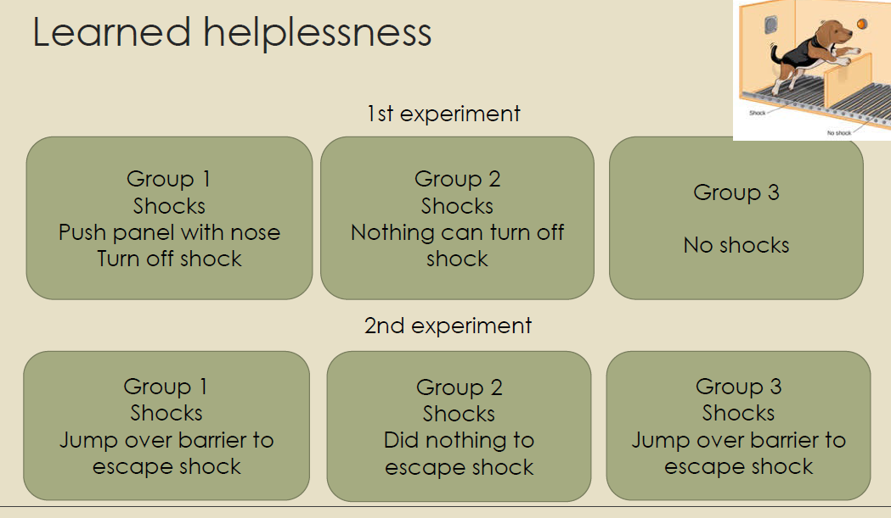
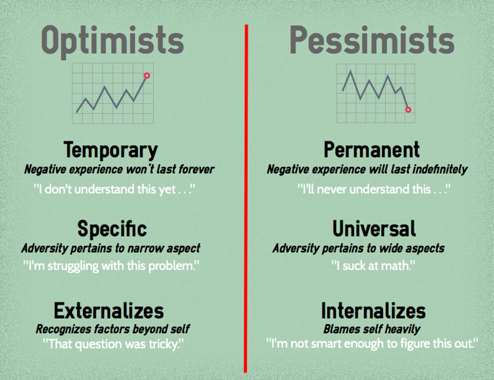
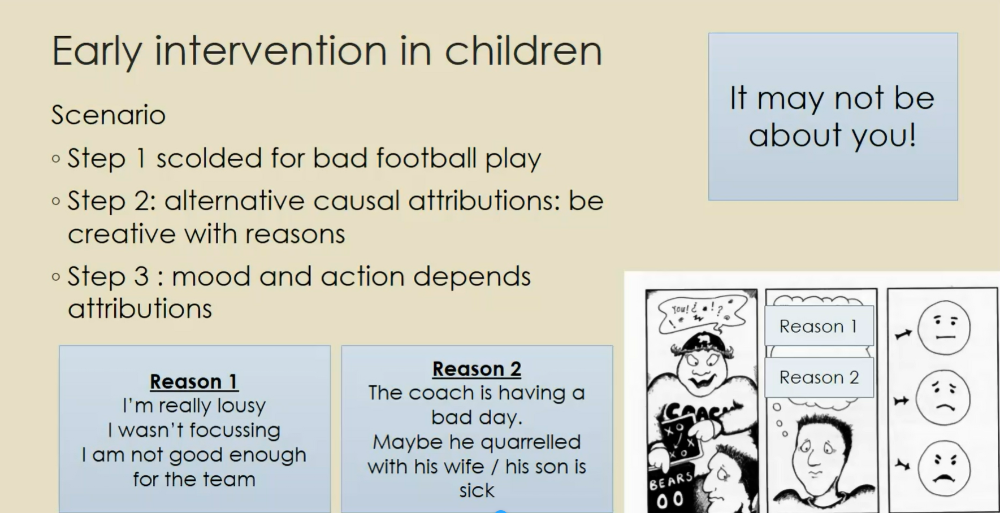
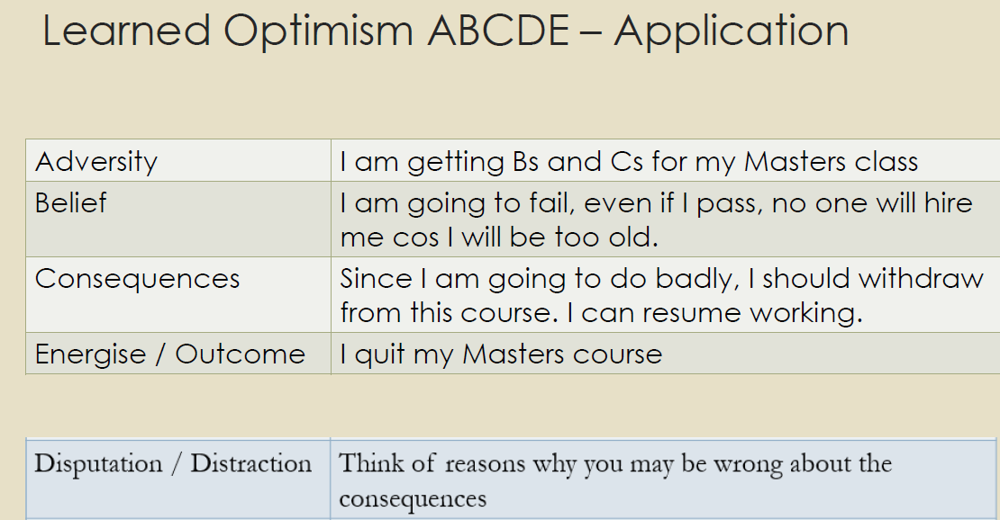
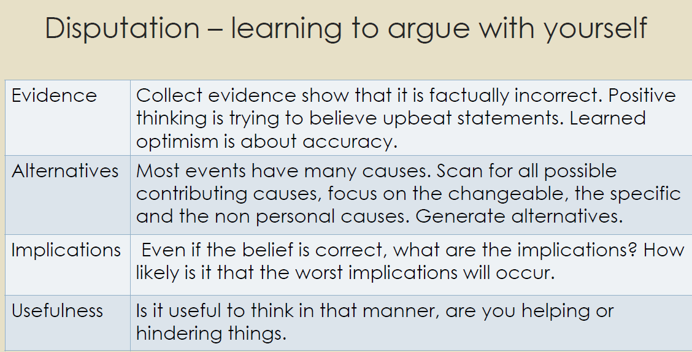
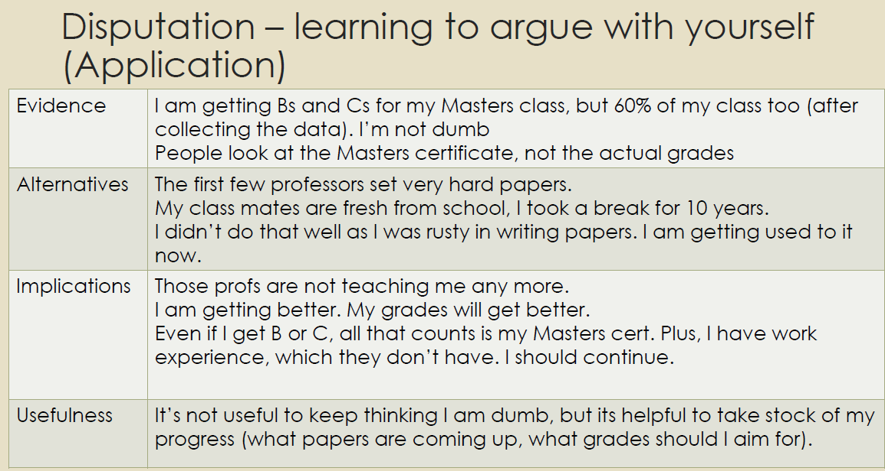
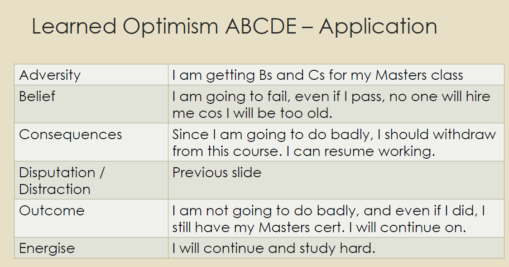
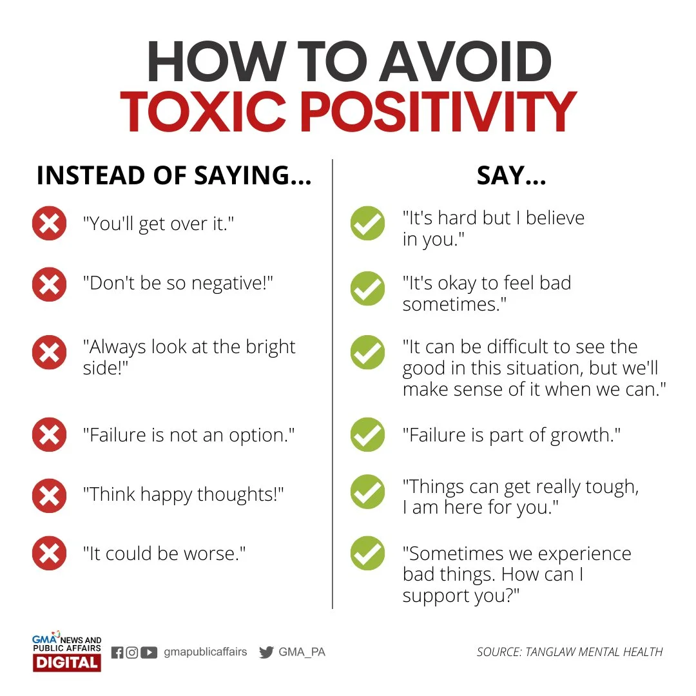

# Lecture 5 Learned Optimism :innocent:

## What is optimism? :star_struck:
- `Optimism`: hopefulness and confidence about the future of the success of something 
- `Pessimism`: a tendency to see the worst aspect of things or believe that the worst will happen
- An `explanatory style`: to describe how people explain the events of their lives

## Learned Helplessness :dog2: 	:cry:
Learn more about [learned helplessness experiment and research](https://en.wikipedia.org/wiki/Learned_helplessness) by Martin Seligman

> `Learned helplessness` is the behavior exhibited by a subject after enduring repeated aversive stimuli beyond their control. It was initially thought to be caused by the subject's acceptance of their powerlessness, by way of their discontinuing attempts to escape or avoid the aversive stimulus, even when such alternatives are unambiguously presented. Upon exhibiting such behavior, the subject was said to have acquired learned helplessness

- Experiments replicated with humans (hiroto) but with noise instead of shocks
- 33% of dogs/people he tried to make helpless did not succumb
- And 10% of dogs who had no shock didn't try to escape the box
> Why do some people give up easily/don't give up even in the face of considerable adversity?

## Explanatory Style - optimist vs perssimist

| Externalizing| Internalizing  |
|---|---|
|  expressing or attributing one's thoughts, emotions, or behaviors to **external factors or influences**. |  involves taking in and accepting thoughts, feelings, or behaviors as part of oneself, often **influenced by personal experiences or internal factors**. |
| *Example: he externalises his anger, meaning that he blames outside circumstances or others instead of acknowledging it as a personal emotion*  | *Example: If someone internalizes success, they may attribute their achievements to their own abilities and efforts, seeing success as a reflection of their skills.*  |

### Pessimism and depression
Zenger et al (2011) study of 97 women with breast cancer and other gynaecological cancer: women with a high level of pessimism are at risk for higher levels of anxiety and depression in addition to lowered health-related quality of life, in the course of disease.
- Seems more important not to be pessimistic than to be optimistic
- How to be optimistic?

### Early intervention in children :child: :girl:
- **Penn Optimism Program (POP)**
    - A 12-week (24 hour) school-based intervention which is delivered in groups of 10 to 12 children
- POP participants were not diagnosably depressed but were at risk for depression due to
    - High levels of family conflict
    - Low levels of family cohesion
    - Or the early onset of mild levels of depressive symptomatology 

## Learned optimism - ABCDE Model :scroll:
*Reference: Learned optimism by Dr Martin Seligman (2006)*

|   |   |
|---|---|
| `Adversity`  |  Be objective about a situation. Record your description of what happened |
| `Belief`  | How you interpret the situation. Separate thoughts from feelings  |
| `Consequences`  | Record your feelings and what you did |
| `Disputation/distraction`  |  Think of reasons why you may be wrong about the consequences |
| `Energise/outcome` |  Actions taken | 

Look at the example below, how to leverage ABCDE model.

The D step is the most important part in ABCDE, we're trying to dispute against our original thoughts. We can use these perspectives to generate ideas:

Disputation in our example:

The overall application of ABCDE model in this example:

### Benefits of optimism
- More successful in school, at work and in athletics
- Healthier and live longer
- More satisfied with their marriages
- Less likely to suffer from depression
- Less anxious
- More positive emotions
- Greater persistence

### Therapy :pill:
- Current therapy focuses on **processing the past**
- Cognitive behavioural therapy that focuses on mastery and control in the future (Depression is the about the future. Possible therapy - painting roiser future)
- Once you are reminded that you can control certain things, you outlook changes

### Optimism and Health
- Optimists **tend to take control of their health**, hence they will take the necessary actions to prevent their illnesses from getting worse
- In a study of head and neck cancer patients, optimistic patients reported **a higher quality of life both before and after treatment, **suggesting that their positive outlook buffered the effects of health-related distress (Allison et al., 2000). Similar findings of lower distress have been reported in individuals undergoing treatment for breast cancer (Carver et al., 1999).
- Optimistic individuals also tend to be **more aware of their health status and how to stay that way.** Radcliffe and Klein’s (2002) studied 146 middle-age adults and found that those with high optimism were more informed about heart attack risk factors, as well as the role of other risk factors on their health: stress, alcohol consumption, nutrition, smoking, fat consumption, and exercise. (I want to know so I can do something about it)
- Optimists may also take a more approach-focused method of dealing with health stressors. Rather than trying to avoid, ignore, or withdraw from a health concern, **optimistic people are more inclined to seek practical support, cognitively restructure, or reinterpret the situation positively, among other coping methods** (Nes& Segerstrom, 2006)
- Studies have also shown that **optimistic people were less likely to need rehospitalization** after a coronary bypass or repeat cardiac operations (Scheieret al., 1999; Helgeson, 2003; Cauleyet al., 2017). They were also less likely to develop high blood pressure than pessimists, suffer from stress-induced changes in immunity, and even develop heart disease in the first instance (Everson et al., 2000; Kubzanskyet al., 2001; Brydon et al., 2009)

## Is being optimistic all good?
- `Optimism bias`: Sometimes excessive optimism can <ins>lead people to overestimate the likelihood that they can experience good things while avoiding bad things</ins>. The optimism bias suggests that people often **underestimate their risk of experiencing negative outcomes**.
    - This can sometimes lead people to engage in risky behaviors that actually increase their chances of having a bad outcome. 
    - (only good things will happen to me, I’m going jumping! )
- **Poor risk assessment**: When people are overly optimistic about something, they may be <ins>less likely to think about all of the potential risks and take steps to mitigate those issues</ins>.
    - This can ultimately make it more likely that their efforts might fail, or at least run into major problems along the way. 
    - (will choose the cheapest company offering the parachute service)

- **Toxic positivity**
    - Sometimes people tend to <ins>overvalue positive feelings while ignoring or even repressing negative ones</ins>. It can also cause people to invalidate the emotional experiences of people who are going through difficult times. 
    - (Lets go! don’t be a party pooper)

## Is being pessimistic all bad?
Normal pessimist - blaming oneself for bad things that happen

`Defensive pessimist`
- **Expect the worst**. The crucial factor is setting low expectations for the outcome of a particular plan or situation – like expecting that you won’t get hired after a job interview –and then envisioning the details of everything that might possibly go wrong to make these worst-case scenarios a reality. This gives the defensive pessimist a plan of action to ensure that any imagined mishaps won’t actually happen–such as practicing for the interview and getting there early.
    - When prompted to be in a good mood, defensive pessimists performed poorly on a series of word puzzles
    - However, when they were put in bad moods, by being instructed to imagine how a scenario might have negative outcomes, they performed significantly better
    - This suggests that they <ins>harness their negative mood to motivate themselves to perform better</ins>

- Being prepared to prevent negative outcomes can also have some very real health benefits. Although these individuals will worry more about getting ill during an outbreak of an infectious disease compared to optimists, they are also <ins>more likely to take preventive action</ins>. For example, they might frequently wash their hands and seek medical care promptly when they experience any unusual symptoms.

## References
- Hiroto, D. S., & Seligman, M. E. (1975). Generality of learned helplessness in man.Journal of Personality and Social Psychology, 31(2), 311–327.
- https://positivepsychology.com/learned-optimism
- https://greatergood.berkeley.edu/article/item/the_benefits_of_optimism
- https://www.webmd.com/balance/news/20110916/optimism-partly-in-your-genes#:~:text=Researchers%20have%20zeroed%20in%20on,the%20love%20or%20cuddle%20hormone
- Markus Zenger,HeideGlaesmer,Michael Höckel,Andreas Hinz,Pessimism Predicts Anxiety, Depression and Quality of Life in Female Cancer PatientsJapanese Journal of Clinical Oncology, Volume 41, Issue 1, January 2011, Pages 87–94,
- Seligman, M. E. P. (2006).Learned optimism: How to change your mind and your life. New York: Vintage Books.