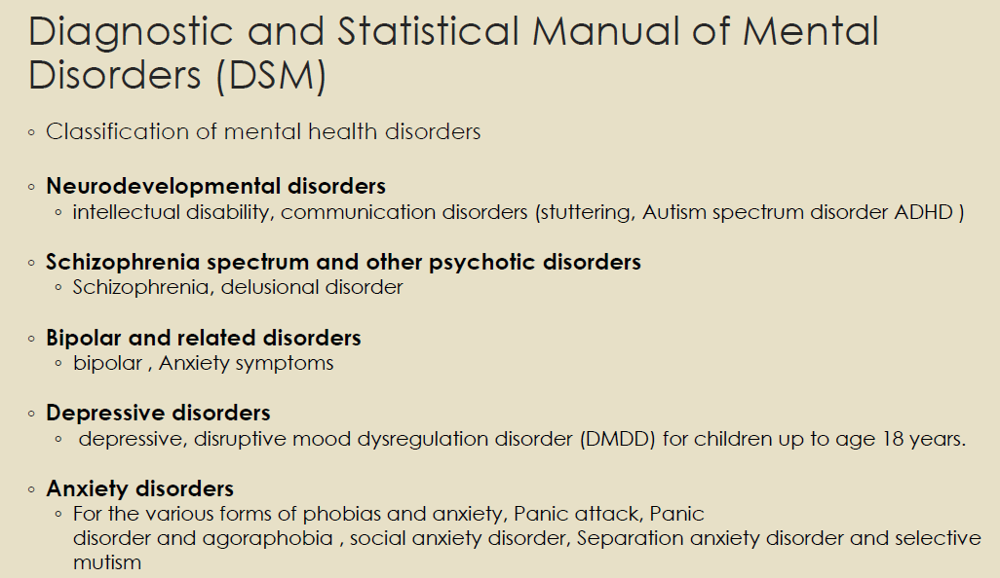
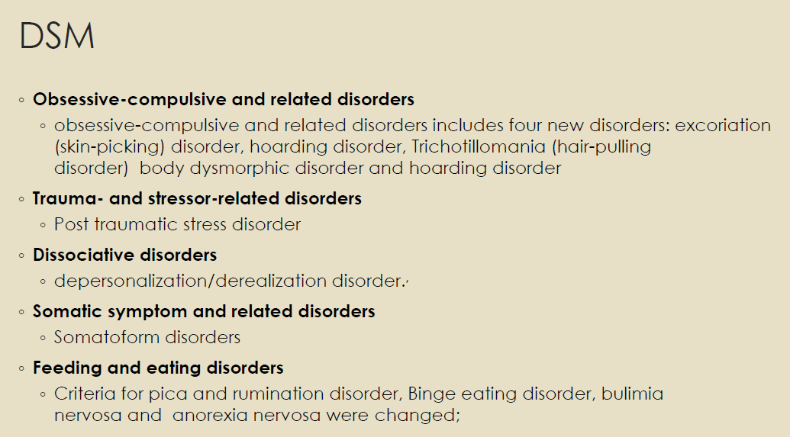
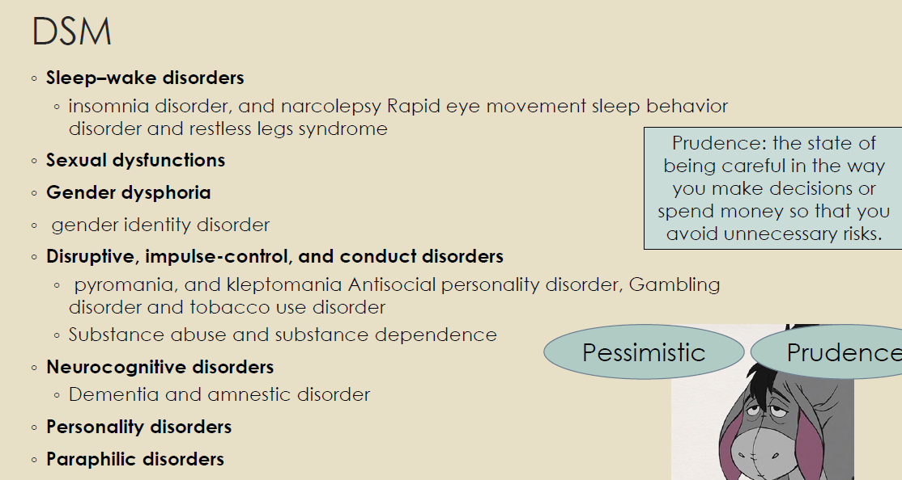
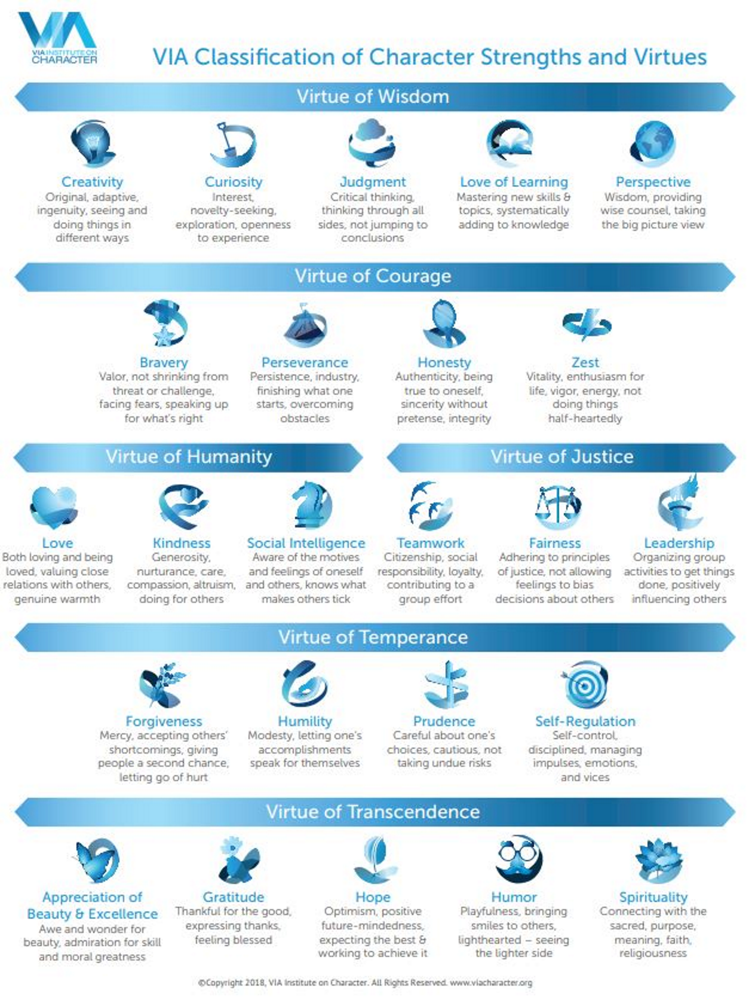
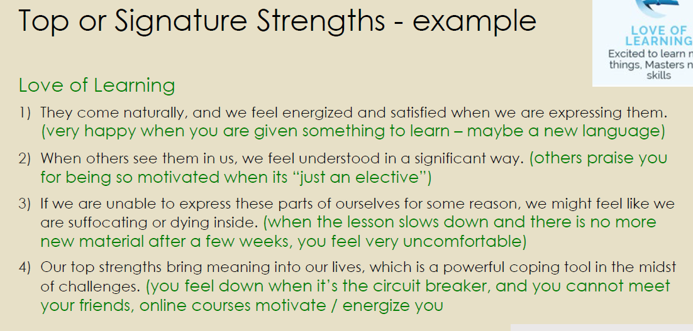
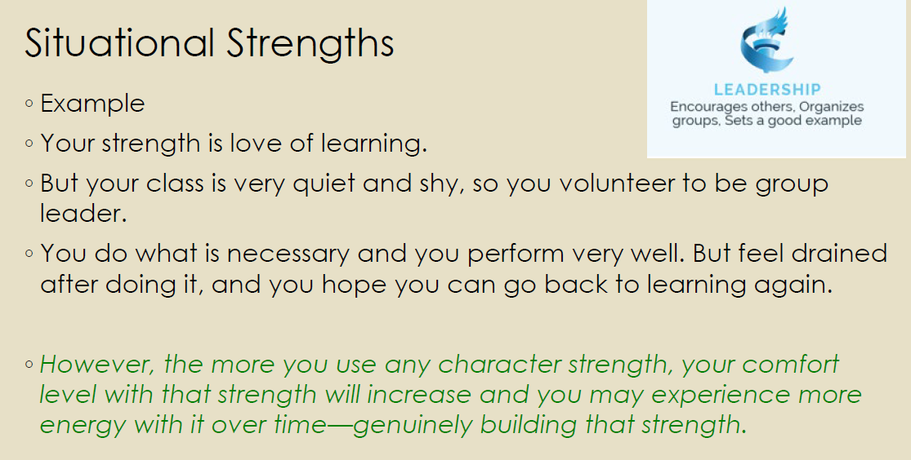
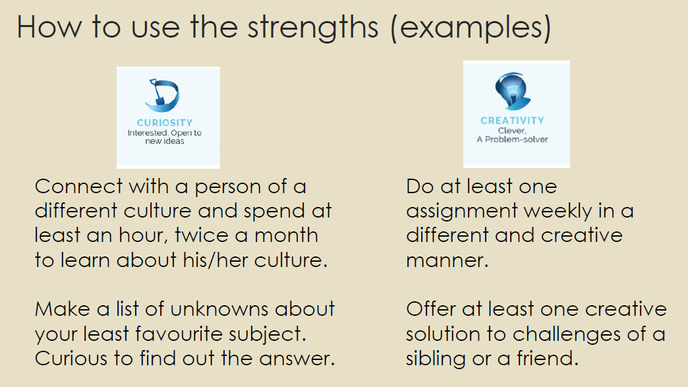
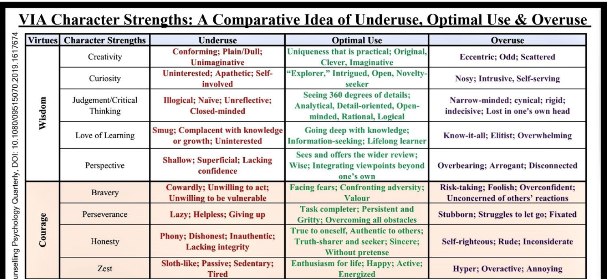

# Lecture 6 VIA Character Strength :mechanical_arm:

- Youth Development practitioners aimed to encourage healthy development.
- VIA institute was created to provide conceptual means of describing **positive youth development, something to work towards and grow**.
- The `Character Strengths and Virtues (CSV)` is the positive psychology counterpart to the `Diagnostic and Statistical Manual of Mental Disorders(DSM)` used in traditional psychology.
- <ins>Unlike the DSM, which scientifically categorizes human deficits and disorders, the CSV classifies positive human strengths.</ins>
    - DSM -5 has 157 disorders

## Diagnostic and Statistical Manual of Mental Disorders (DSM)
It's a classification of mental health disorders. :bookmark_tabs:

## Strengths vs Talents :swimmer:
- **Strengths are moral traits**, talents are not
- Moral: concerned with principles of right and wrong behaviour

| Strengths | Talents  |
|---|---|
| Moral (honesty)  |  Non-moral (singing) |
|  More buildable | Less buildable  |
| Voluntary  | Automatic  |
| Need to make a choice to use strengths  | Usually born with it/have it  |

## What are character strengths?
1) **A strength is a trait, a psychological characteristic over situations and time**. A onetime display of kindness does not make a trait
2) A strength is valued in its own right and not only for the tangible outcomes in may produce. Strengths often produce good consequences. Leadership produces promotion, raises etc; but they are still valued for its own sake.
3) **The display of strength does not diminish** (meaning: cause to seem less impressive or valuable) **other people,** in fact onlookers are often elevated and inspired by observing the virtuous action
4) Strengths are ubiquitous (i.e. present everywhere), **valued in every culture** around the world.

## 24 Character Strengths

How do you know these are your strengths?
- is it authentic?
- does it show up often?
- do others notice?
- does using it energize me?
- if unable to express it, would I feel empty?

### Top/signature Strength 	:top:
> **Signature strength**: the strongest or most prominent strength in your own strength profile
1) They come naturally, and we feel energized and satisfied when we are expressing them
2) When others see them in us, we feel understood in a significant way
3) If we are unable to express these parts of ourselves for some reason, we might feel like we are suffocating or dying inside
4) Our top strengths bring meaning into our lives, which is a powerful coping tool in the midst of challenges.

### Situational Strength :frowning:
- These are strengths <ins>we call forth when we need to.</ins>
- These are lesser strengths, it is draining to do it.
- People can “step up” and invoke any strength when needed—even if they find it daunting.
- The difference between situational strengths and top strengths is that people need to express top strengths to feel whole and energized, but they are comfortable expressing situational strengths only when they are needed.

### Multiple intelligences
- **Verbal linguistic** - the ability to read, write, speak and memorize words
- **logical mathematical**- the ability to deal with logic, numbers, reasoning, and critical thinking
- **musical** - sensitivity to sounds, rhythms, tones and the ability to sing, play musical instruments and even compose melody
- **visual-spatial** - ability to generally be aware of one's surroundings, judge distance/depth/height/size/volume, and ability to use read maps, etc
- **Body-Kinesthetics** –The ability to use one’s body effectively, essential for roles such as a dancer, actor or surgeon.
- **Interpersonal** –The ability to understand and communicate with other people.
- **Intrapersonal** –The ability to understand one’s own interest and goals, and to control one’s emotion.
- **Naturalistic** –The ability to understand the natural environment.

## How to use the strengths
- Use your signature strengths every day to maximize work satisfaction,
- Recrafting your job to deploy your strengths and virtues everyday not only makes work enjoyable but makes it a `calling`. A calling (or a vocation) is a passionate commitment to work for its own sake (not for the material benefits its brings.)
- Using your strengths is fulfilling in its own right, without regard for money or advancement.
Flow occurs when the challenges you face perfectly mesh with your abilities / strengths / virtues to meet them.

## Weaknesses/areas for improvement
- VIA classifies the **bottom five strengths as `lesser strengths`**, not weaknesses.
- It could be that you may not have had opportunities to use them, not that you are not good at them.
- You can also think of ways to use them, as how you would use the other strengths
But by focusing more on your top strengths you have less time to dwell on your ~~weakness~~ lesser strengths

In short:
- Start thinking about your strengths
- Think of ways you can use them
- Using them will bring you engagement and FLOW