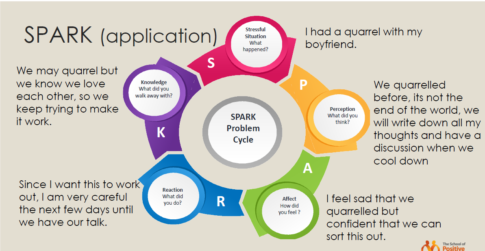

# Lecture 7 Resilience :sunrise_over_mountains:
> **Resilience** is the ability to persist, grow and thrive in the face of challenges and to bounce back from adversity.

- We need resilience to: overcome, bounce back, steer through, reach out, maintain balance in our lives during stressful periods, prevent mental health issues...
- Truth about resilience
    - Share it
    - Muddle through
    - Feel it
    - Built over experience
- <ins>Having resilience != people experience less distress, grief or anxiety than other people</ins>
    - They have healthy coping skills to handle such difficulties in ways that foster strength and growth.
    - In many cases, they may emerge even stronger than they were before
        - Not that you don't fall, it's that you will get back up again
        - Each negative event that you overcome prepares you for the next bigger one

## SPARK Model 	:sparkler:
- S: `stressful situation`, what happened
- P: `perception`, what do you think
- A: `affect`, how did you feel
- R: `reaction`, what did you do
- K: `knowledge`, what did you walk away with

> `Positive reappraisal`: <ins>Changing your mind to see things in a new way that may be more beneficial to us now or in the future.</ins> So even when the worst happens, positive reappraisal involves daring to think about a stressful situation in **a new way** and being open to how you might learn, grow, or benefit from it. This will help you to overcome bigger challenges in the future.

- **Avoid seeing crises as insurmountable problems.**
    - Try looking beyond the present to how future circumstances may be a little better
- **Accept that change is a part of living**
    - Accepting circumstances that cannot be changed can help you focus on circumstances that you can alter
- **Growth mindset.**
    - You didn't fall. You haven't succeeded yet.

### Thinking traps 	:mouse_trap::warning:
| Name | Description  | Example  | Replacement  |
|---|---|---|---|
| All-or-nothing thinking  | Seeing everything as black and white  | "I didn’tget the job. I’m rubbish at everything".  | "Nothing in life is perfect. Even though I didn’t get the job, it doesn’t mean I’m a failure. There are better things to come"  |
| Emotional reasoning  | Believing emotions to be evidence of truth  | "I feel useless, therefore I am useless".  | "My feelings are not real evidence for reality. I can accept all of my feelings but still move forward".  |
| Mind-reading  | Immediately assume that someone is thinking something negative about you without having any evidence for it. Jumping to conclusions.  | You see a classmate laughing with someone else. When you approach them, they keep quiet. You think, "They don’t really like me."  | "I can't guess their minds, let me ask"  |
| Fortune telling  | Predicting situations with only negative outcomes  | "I’m definitely going to fail the exam today". (some peopleskip the exam)  | "No one can possibly predict the future".  |
| Overgeneralization  | Whenever something difficult happens you think it's going to happen over and over again | "why does this always happen to me?" (often use words like 'never' 'every' and 'always' )  | Lookfor evidence, is it "always"?  |
| Labelling  | Wrongly attributing a negative label to either yourself or someone else.  | "I’m a failure"  | "I failed the exam" |
| Personalization  | Wrongfully assuming responsibility for something   | "It’s all my fault we didn’t win the tournament cos I didn’t practice hardenough".  |  "It’s nobody’s fault". Not always about me. |
| Catastrophizing  | Assumes that the worst will happen. Often, it involves believing that you're in a worse situation than you really are or exaggerating the difficulties you face.  | "I hada quarrel with my boyfriend. He will leave me, I will never find anyone else, and I will never be happy again."  | Is this outcome truly a catastrophe, or is it a hiccup? What can I do to patchup with him? What can I learn from this so that it wont happen again?  |

### Example of SPARK application~

After applying SPARK application:

## How to build resilience :building_construction:
- Building resilience is like `inoculation` - have to be exposed to stress, frame it positively and recover effectively
    - *Inoculation: the action of immunizing someone against a disease by introducing infective material, microorganisms, or vaccine into the body.*
- `Hormesis` - "what doesn't kill you makes you stronger" type of stress
- Your body thrives on occasional stress or toxin exposure, and responds by ramping up growth and repair, to bring you back to balance. You're designed to handle minor and occasional stress.
- With exercise, you need to damage your muscles, otherwise your body won’t build them back stronger. Your brain needs challenges —learning a new language, doing something creative, and so on —to build new connections between brain cells and become sharper.
- Training your brain to withstand stressors strengthens your adaptive stress response.

## GRIT (by Angela Lee Duckworth) :fist:
> GRIT is **perseverance and passion for long-term goals**, a signigicant predictor of success
- While teaching math to 7th graders, found that it was not the smartest students who did the best.
- Also after taking a grit test, high schoolers who score higher were more likely to graduate.

### Replenish your resources :heavy_plus_sign:
1) **Physical wellbeing**
    - Move regularly
    - Eat well
    - Have a sleep routine

2) **Social wellbeing** - interacting with others
    - Allows us to love, be loved and feel valued
    - Satisfy our need for connection and belonging
    - Friends offer emotional and practical support
    - Help us celebrate success and achievements
    - Provides new perspectives on our challenges

3) **Remembering your life's meaning and purpose**
    - Helps us focus on something bigger than ourselves
    - Maximize our potential
    - Helps us make sense of the world
    - Clarifies our goals and directions
    - Helps us get back on our feet again, after falling 

## References :book:
- https://www.thechelseapsychologyclinic.com/mood-management/thinking-traps/
- https://www.verywellmind.com/what-is-resilience-2795059
- https://www.ororecovery.com/9-famous-people-celebrities-with-social-anxiety-disorders/
- The School of Positive Psychology –Resilience workshop

## yay, more resilient!
