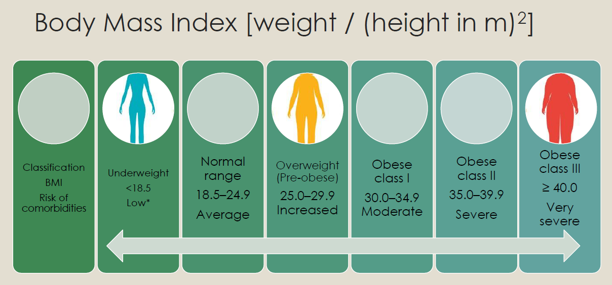
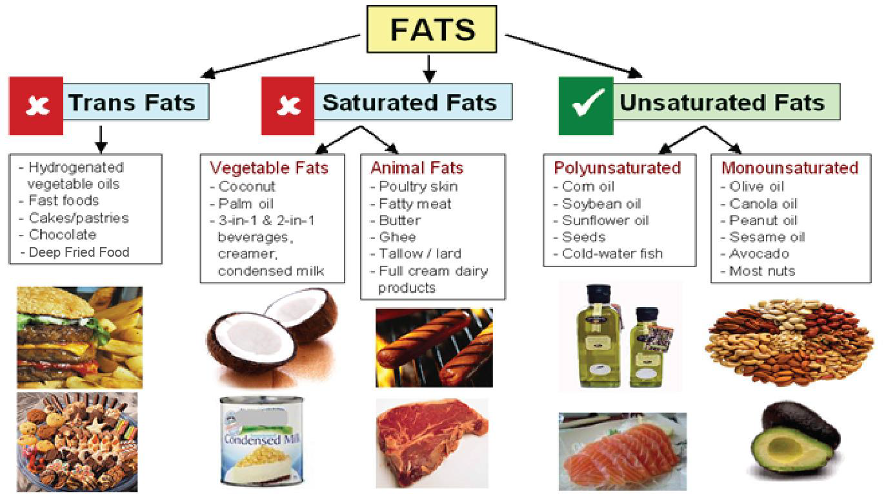
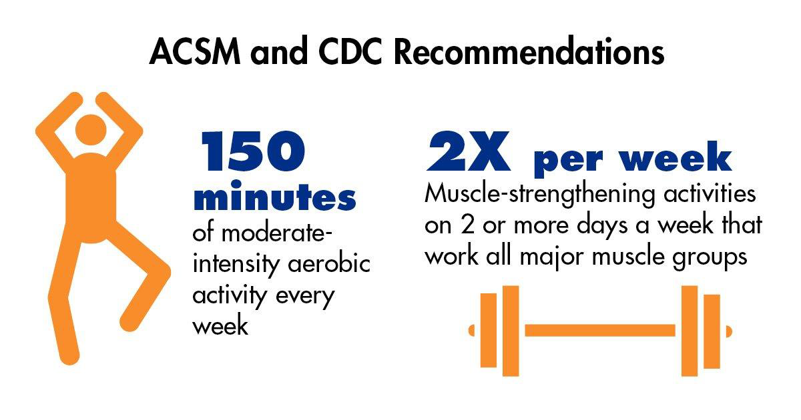
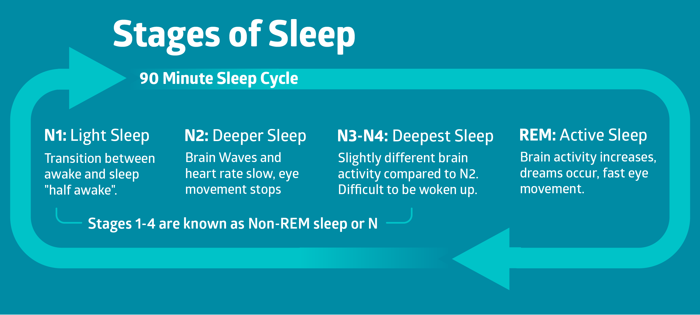
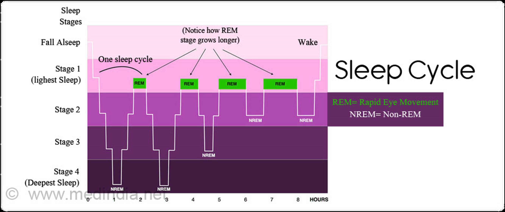
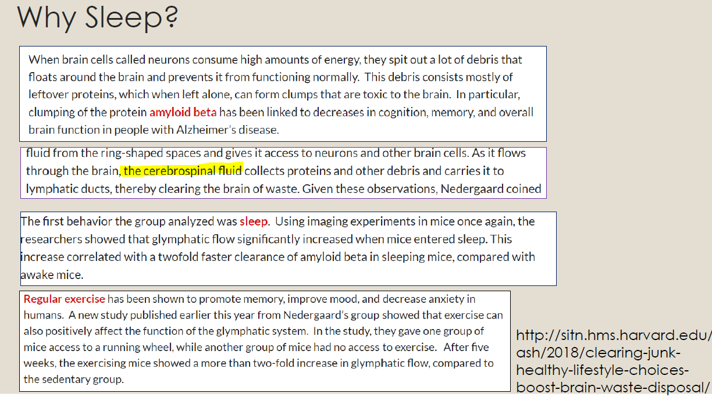

# Lecture 8 Energy Management (1) :fuelpump:

By Energy, the 2 main parts are `Physical energy` & `Psychological energy`. 
- physical energy is related to nutrition, exercise, sleep, etc.
- psychological energy is related to cognitive, sociomotional and spiritual perspectives.

We will discuss about physical energy here.

## Link between nutrition and mental health :bento:
- Adherence to healthy or Mediterranean dietary patterns is associated with a reduced risk of depression .
- While a diet rich in processed food seems to show an association with depressive symptoms ( BMJ 2020)
    - whole foods: Fresh fruits and vegetables, eggs, grilled chicken, fish and beef, and whole grains, nuts and seeds.
    - processed foods: Breakfast cereals, muffins, white bread, sugary yogurts, low fat potato chips, canned foods, processed meats, fruit juices and diet beverages.
> Although potato chips are tasty, you should eat fresh whole foods too!

### Macronutrients
| Carbohydrates  | Fats  | Proteins  |
|---|---|---|
| 4 calories per gram and typically make up the largest portion of people's calorie intake  | 9 calories per gram.  | 4 calories per gram.  |
| Carbohydrates include sugars, starches and fibers. Most types of carbs get broken down into glucose, or blood sugar, which your body either uses for immediate energy or stores as glycogen (the storage of glucose) in your liver and muscles  | Your body needs fat for energy and critical functions, such as hormone production, nutrient absorption and body temperature maintenance. Range from 20-35% of total calories.  | proteins are vital for processes like cell signaling, immune function and the building of tissues, hormones and enzemes.10-35% of your total calories intake. Protein recommendations vary depending on body composition goals, age and health and more.  |
| Found in food like grains, starchy vegetables, beans, dairy products and fruits.  | Found in foods like oils, butter, avocado, nuts, meat and fatty fish.  | eggs, poultry, fish, tofu and lentils.    |

### BMI - Body mass index
>  $`BMI = (weight\ in\ KG) / (height\ in\ m)^2 `$

- **subcutaneous fat**: jiggly fat visible just under the skin
- **Visceral fat**: fat that surrounds the organs. It is not visible from the outside; associated with numerous diseases

### Active components in functional foods
- Functional foods are ingredients that **offer health benefits that extend beyond their nutritional value.** Oats for instance, contain a type of fiber called beta glucan, which has been shown to reduce inflammation, enhance immune function and improve heart health.
- Major classes
    - Antioxidants and phytochemicals
    - Prebiotics and probiotics
    - Others
        - Dietary fibers
        - Amino acids
        - Oligosaccharides
        - Isoprenoids and vitamins
        - Bioactive proteins/peptides
        - Sugar alcohols
        - Minerals
        - Unsaturated fatty acids

## Link between exercise and mental health :running:
Research has shown that exercise is an effective but often underused treatment for mild to moderate depression

1. **Cardiovascular**: Often referred to as aerobic, increase your breathing and heart rates. Endurance exercises improve the health of your heart, lungs, and circulatory system
2. **Strength**: Strength training using weight to improve your muscle strength keeping your muscles strong can help with your balance and prevent falls and fall-related injuries
3. **Flexibility**: Activities that lengthen and stretch muscles can help you prevent injuries, back pain and balance problems. A well-stretched muscle more easily achieves full range of motion.
4. **Balance**: Balance training involves doing exercises that strengthen the muscles that help keep you upright, including your legs and core. These kinds of exercises can improve stability and help prevent falls.

## Link between sleep and mental health :sleeping:
- Upenn researchers - subjects who were limited to only 4.5 hours of sleep a night for one week reported feeling more stressed, angry, sad, and mentally exhausted
- In one major study of 10000 adults, people with insomnia were fives times more likely to develop depression
- In the same study, people with insomnia were 20 times more likely to develop panic disorder (a type of anxiety disorder)

### Sleep advice
- Try to get 7-9 hours of sleep every day
- Train your body to go to bed and wake up at the same time each day
- Exercise no later than 2-3 hours before bedtime
- No food 3 hours before bedtime
- Avoid alcohol before bedtime
- Wind down 1-2 hours before you plan to fall asleep (e.g., no screen time)
- Keep bedroom quiet, dark and free from distractions

**Mind-body connection**:  your mental state affects the health of your body, and the reverse happens too

## References :book:
- Firth J, Gangwisch J E, Borsini A, Wootton R E, Mayer E A. Food and mood: how do diet and nutrition affect mental wellbeing? BMJ 2020; 369 :m2382
- https://courses.lumenlearning.com/waymaker-psychology/chapter/stages-of-sleep
- https://healthysleep.med.harvard.edu/needs-sleep/whats-in-it-for-you/mood
- https/www.shutterstock.com/image-illustration/cycles-sleep-1198377799
- http://sitn.hms.harvard.edu/flash/2018/clearing-junk-healthy-lifestyle-choices-boost-brain-waste-disposal
- https://www.webmd.com/depression/guide/exercise-depression#1
- https://www.nia.nih.gov/health/four-types-exercise-can-improve-your-health-and-physical-ability
- Slides from Ms Choo Yang Sim, CLS
- Slides from Mr Paul Oh, CLS