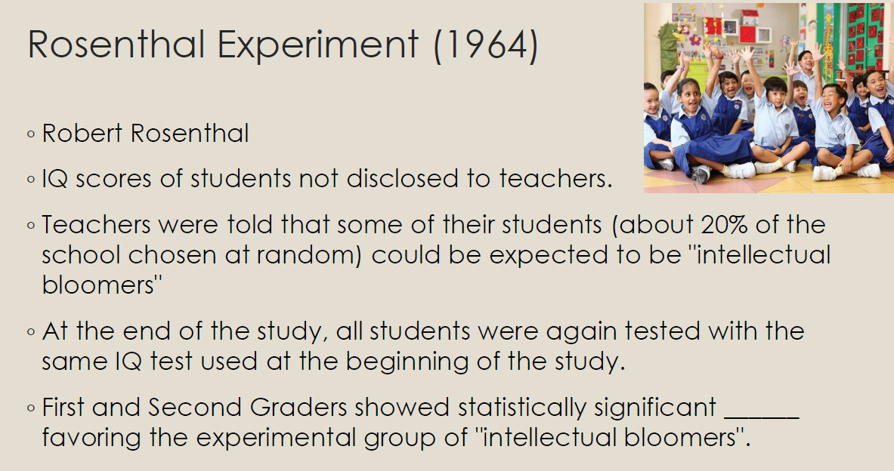
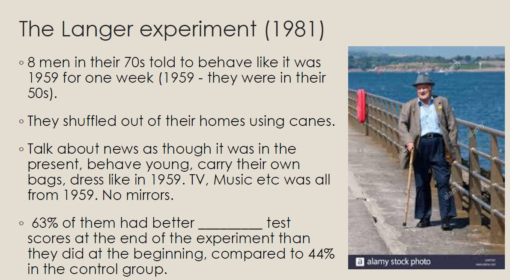
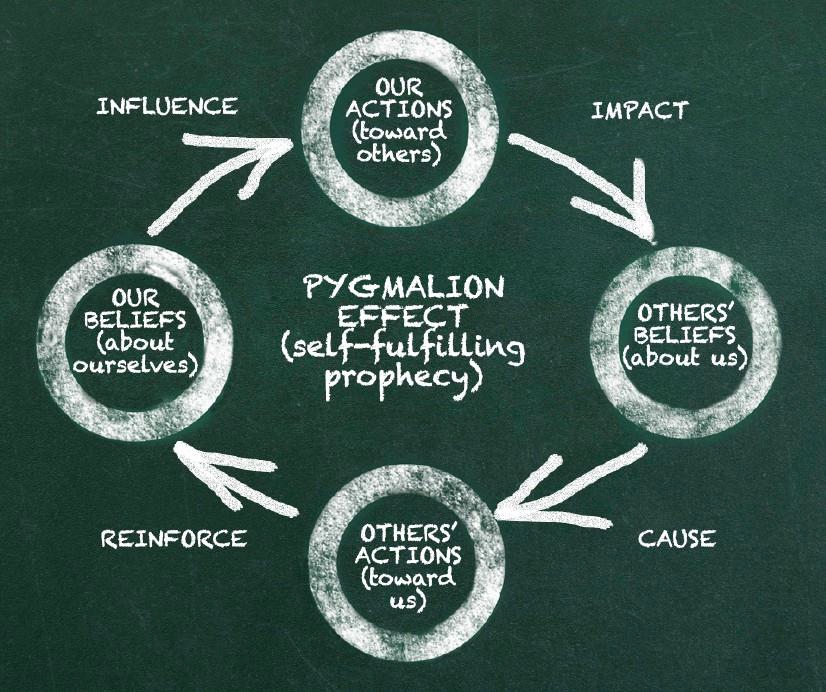
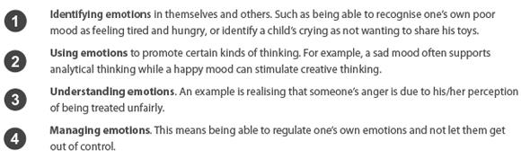
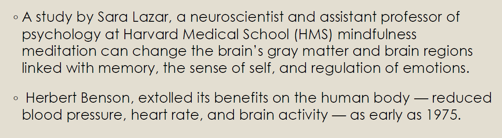
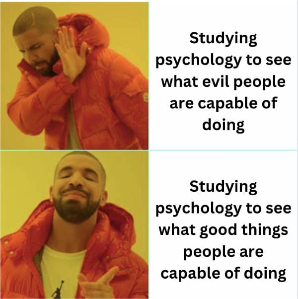
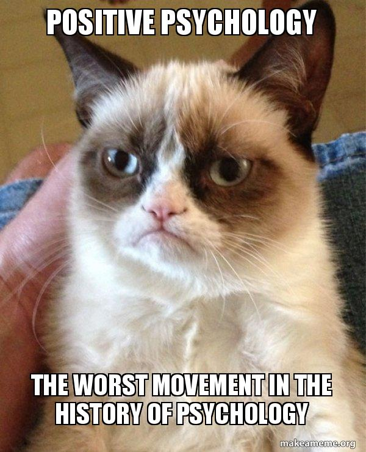

# Lecture 9 Energy Management (2) :fuelpump:

Continue lecture 8, we will talk more about `psychological energy` in this chapter.

## Cognitive energy :thinking:
- Growth mindset, learned optimism, thinking traps, SPARK model…
- **Power of belief**
    - 4 minute mile (1.60934km) is believed to be impossible to complete, however Roger Bannister was the first person to complete this 4 min mile in 1954, in the same year there were two more people who complete it; so far more than 1400 people have done it
    - Rosenthal experiment (1964)
        - Teachers' expectations particularly for youngest students, can influence student development
        - Rosenthal believed that even attitude or mood could positively affect the students when the teacher was made aware of the "bloomers"
        - Teachers may pay closer attention to and even treat the children differently in times of difficulties
    

    - the Langer experiment (1981)
        - Have better IQ test
        - "after" photo looks on average two years than "before" 
        - Become more flexible, hearing and sight improved
    

    > Believe in yourself, believe in others!

### The pygmalion effect :arrows_counterclockwise:
> The Pygmalion effect is a psychological phenomenon in which **high expectations lead to improved performance in a given area and low expectations lead to worse.**

Read more at [Pygmalion effect](https://en.wikipedia.org/wiki/Pygmalion_effect)

- You will do better if you feel people believe in you
- Likewise, if you want people to do better, believe in them and cheer them on
- It's a virtuous circle, believe in yourself first

### Is feeling stressed always bad :persevere:
- Many view stress as bad, rather than its original meaning of "the non-specific responses of the body to any demand for change" (Sleye, 1965)
- The notion is that stress is unhealthy, can lead to cardiovascular diseases, anxiety and depression has become part of current global perception
- With this prevailing belief, many become stressed about stress
    - `Eustress`: a positive response one has to a stressor
    - `Distress`: a negative response
- Stress is the outcome of primal reaction known as fight-or-flight.
Flooding of hormones, increased heart rate, hyper awareness, cause a burst of energy, couple with emotions like anger, aggression, anxiety, helping to escape the saber tooth cat

Good stress - `eustress` can lead to f**ocused attention, emotional balance and rational thoughts**
- Only lasts in the short term
- It energizes and motivates
- Perceived as something within our coping abilities
- Feels exciting
- Increases focus and performance

Bad stress - `distress`, can cause **impaired attention, boredom, confusion, apathy, excitement, burnout and disorganized behavior**
- Triggering anxiety and concern
- Surpassing our coping abilities
- Generating unpleasant feelings
- Decreasing focus and performance
- Contributing to mental and physical problems

In terms of fatality: People who experience a lot of stress and believe that stress is harmful > people who don't experience a lot of stress **>= people who do not believe that stress is harmful** 
- Accepting that these feelings are your body's way of helping you to cope with the challenge
- When you feel stressed, release oxytocin, hug hormone, so you seek connection with others to gain courage and motivation. As we connect, we can quiet some fears and increase our hope, making us more optimistic toward stressors
- For major life stress, people had 30% higher risk of dying, but <ins>those who helped or cared for others showed no stress related increase in dying.</ins> -> caring created resilience

> Accept the stress you're feeling. Please seek help when you feel stressed & need help. and kindly give a hand to those who need your help!

## Socio emotional energy :dancers:
- `Emotional intelligence`: The capacity of *recognizing our own feelings and those of others,* for *motivating ourselves*, and for *managing emotions* well in ourselves and in our relationships
    - Being aware of your feelings and thoughts, use the knowledge to **make optimal decisions and built relationships**
- Numerous studies have shown that people with high EI are better at coping with social challenges, social stress and interpersonal conflicts
- Regulating your own emotions and getting along socially with others will result in more PERMA and hence greater wellbeing

## Spiritual energy :latin_cross:
- Spiritual wellness is **being connected to something greater than yourself** and having a set of values, principles, morals and beliefs that provide a sense of purpose and meaning to life, then using those principles to guide your actions.
- <ins>Not limited to religion</ins>
- It has the power and capability to make our decisions and choices easier, ground us during periods of change and give us resiliency to survive with grace and inner peace in the face of adversity
- Having a spiritual element in our lives may even help us heal when suffering from a physical or mental condition

## Mindfulness (from lecture 3)
- **Basic human ability to be fully present, aware of where we are and what we are doing, and not overly reactive or overwhelmed by what is going on around us**
    - Our minds wander 47% of time
    - A wandering mind is unhappy mind
    - Mindfulness helps the default mind network
    - DMN - default mind network, region used when not focusing on tasks. Same region as when you're thinking about past and future (get out of here and now)
- Use meditation to shut down DMN in daily life, not only during meditation. Strengthen brain matter, higher grades with meditation compared with nutrition 
Reduces stress and anxiety, improves attention and memory and promotes self-regulation and empathy

> You may review lecture 2 to revisit the positive interventions, and try to practice them in your daily life.

## References :book:
- Carmeli , A. (2003). The relationship between emotional intelligence and work attitudes, behavior and outcomes: An examination among senior managers. Journal of Managerial Psychology, 18 (8), 788 813
- Goleman, Daniel. Emotional Intelligence. New York: Bantam Books, 1995
- https://www.lhsfna.org/index.cfm/lifelines/september-2016/spiritual-wellness-what-is-your-meaning-and-purpose
- https://news.harvard.edu/gazette/story/2018/04/less-stress-clearer-thoughts-with
mindfulness-meditation/
- https://positivepsychology.com/what-is-eustress
- Kelly MacGonigal Ted Talk, How to make stress your friend
https://youtu.be/RcGyVTAoXEU
- Langer EJ. Counter clockwise: mindful health and the power of possibility . New York, NY, USA: Ballantine Books, 2009. Google Scholar
- Rosenthal R, Jacobson L. Teachers’ Expectancies: Determinants of Pupils’ IQ Gains.
Psychological Reports. 1966;19(1):115 118. doi:10.2466/pr0.1966.19.1.115
- Science of Mindfulness https://www.youtube.com/watch?time_continue=1&v=bHqMwXvaNxM&feature=emb_log

# Ending~
Congrats on finish studying PPWB! Through the lectures we've covered the main positive psychology concepts and hopefully you've gained some unique experience studying this module. 

Please continue practicing what you have experienced and feel free to share the techniques with loved ones to benefit them :D Be an ambassador for PP!

> If you didn't like this mod, I have this for you:

